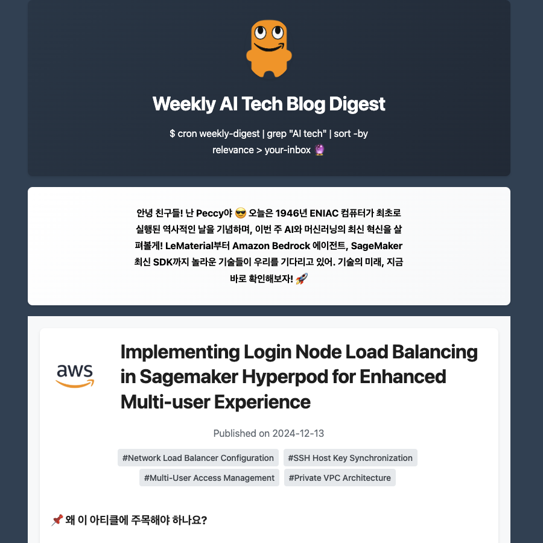
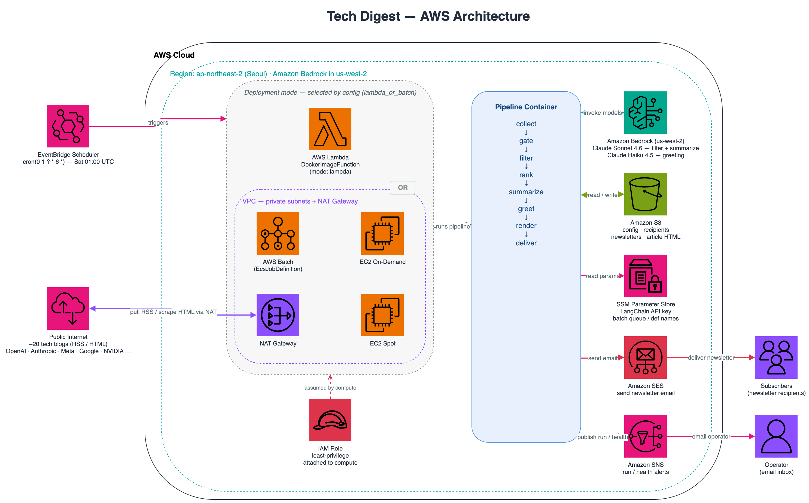
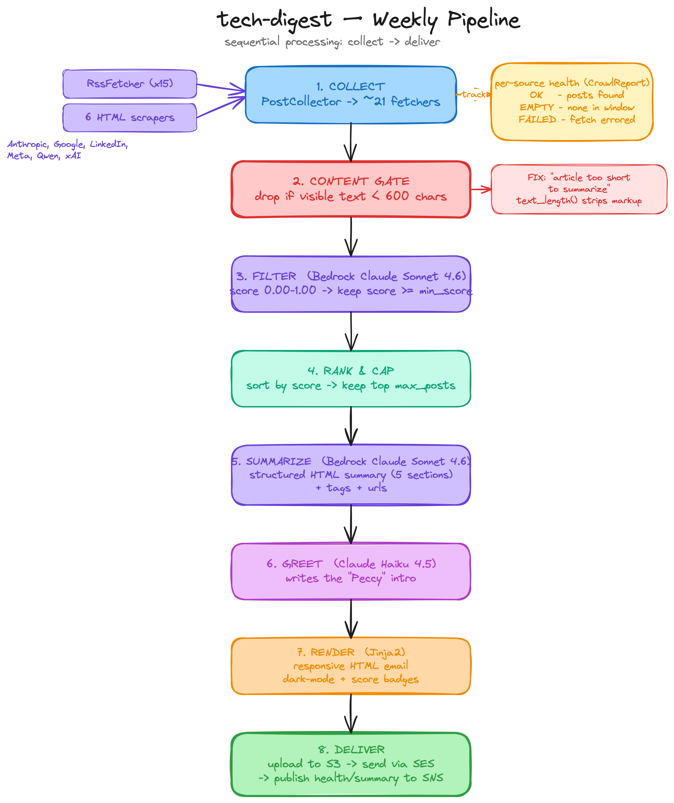

<div align="center">

# 🤖 Weekly AI Tech Blog Digest

**An automated newsletter that curates, filters, summarizes, and emails the week's best AI/ML engineering posts.**

Powered by Amazon Bedrock (Claude) · orchestrated on AWS, defined with the CDK.

[](https://github.com/bits-bytes-nn/tech-digest/actions/workflows/ci.yml)


-green)

🇰🇷 [한국어 README](./README.ko.md)



</div>

---

## ✨ Features

- **AI-powered curation** — Claude (via Amazon Bedrock) scores each post for
  relevance and writes a structured, multi-section summary.
- **Multi-source aggregation** — pulls from ~20 tech blogs via RSS and resilient
  HTML scraping (AWS, Google, Meta, OpenAI, Anthropic, NVIDIA, and more), with
  SSRF-guarded requests and per-source health tracking.
- **Content quality gate** — drops posts whose visible text is too thin to
  summarize *before* they reach the LLM, so the digest never ships empty write-ups.
- **Crawl-health monitoring** — tracks every source's fetch status and raises an
  SNS alert when a source fails, so silent breakage surfaces fast.
- **Serverless infrastructure** — AWS Lambda *or* Batch (config-selectable),
  scheduled by EventBridge, defined as code with the AWS CDK.
- **Professional email** — responsive HTML templates with dark-mode support,
  per-source logos, and score badges, delivered through Amazon SES.

---

## 📐 Documentation

**AWS architecture** — infrastructure & data flow:



**Processing pipeline** — ingestion → delivery:



---

## 🏗️ Architecture

### Core components

| Module | Responsibility |
| --- | --- |
| `feed_parser.py` | RSS parsing + resilient HTML scraping (BeautifulSoup4 / Selenium), per-source health tracking |
| `summarizer.py` | Content gate → relevance filter → rank/cap → summarize, all via Bedrock |
| `newsletter_renderer.py` | HTML generation with Jinja2 (responsive, dark-mode, score badges) |
| `aws_helpers.py` | S3, SES, SNS, SSM, and Batch operations |

### Pipeline

```
collect → gate → filter → rank → summarize → greet → render → deliver
```

### Infrastructure

- **Lambda / Batch** — execution environment selected by `lambda_or_batch`.
- **EventBridge** — scheduled execution (default: Saturdays 01:00 UTC).
- **S3** — config, recipients, generated newsletters, and article HTML.
- **SSM Parameter Store** — LangChain API key and Batch queue/definition names.
- **SES** — newsletter delivery. **SNS** — run/health notifications.
- **Bedrock (us-west-2)** — Claude Sonnet 5 (filter + summarize), Claude
  Haiku 4.5 (greeting).

---

## 🛠️ Tech Stack

- **Language / IaC:** Python 3.12+, AWS CDK, Docker
- **AI:** Amazon Bedrock, LangChain
- **Scraping:** Feedparser, BeautifulSoup4, Selenium
- **Rendering / config:** Jinja2, Pydantic, YAML

---

## 📋 Configuration

Create `app/configs/config-{stage}.yaml` (e.g. `config-dev.yaml`). The four
top-level sections map to the Pydantic models in
[`app/configs/config.py`](./app/configs/config.py):

```yaml
resources:
  project_name: tech-digest
  stage: dev
  lambda_or_batch: batch
  cron_expression: "cron(0 1 ? * 6 *)"   # Saturdays 01:00 UTC

scraping:
  min_content_length: 600                # drop posts thinner than this (visible chars)
  rss_urls:
    - "https://aws.amazon.com/blogs/amazon-ai/feed/"
    - "https://www.amazon.science/index.rss"

summarization:
  filtering_model_id: anthropic.claude-sonnet-5
  summarization_model_id: anthropic.claude-sonnet-5
  greeting_model_id: anthropic.claude-haiku-4-5-20251001-v1:0
  min_score: 0.7                         # keep posts scoring >= this
  max_posts: 5                           # cap kept posts (applied before summarizing)

newsletter:
  sender: "your-verified-sender@example.com"
  header_title: "Weekly AI Tech Blog Digest"
```

> Model IDs come from the `LanguageModelId` catalog in
> [`app/src/constants.py`](./app/src/constants.py).

---

## 🚀 Usage

### Deploy infrastructure

```bash
python scripts/deploy_infra.py
```

### Run locally

```bash
# Install runtime dependencies
pip install -r requirements.txt

# Configure environment
cp .env.template .env        # then edit .env

# Generate and send a digest for a given week
python app/main.py --end-date 2026-06-03 --recipients you@example.com

# Or submit it as a Batch job
python app/run_batch.py --end-date 2026-06-03 --language ko --recipients you@example.com
```

### Test & quality gates

```bash
# Install dev tooling (ruff, mypy, pytest)
pip install -e ".[dev]"

# Lint, format-check, type-check, and test
ruff check .
ruff format --check .
cd app && mypy .             # run from app/ so the dual import layout resolves;
                             # `.` (not `src`) also checks main.py / run_batch.py
pytest                       # fast, offline unit/integration suite (324 tests)
```

These same checks run in CI on every push and pull request
([`.github/workflows/ci.yml`](./.github/workflows/ci.yml)).

---

## 📄 License

MIT
