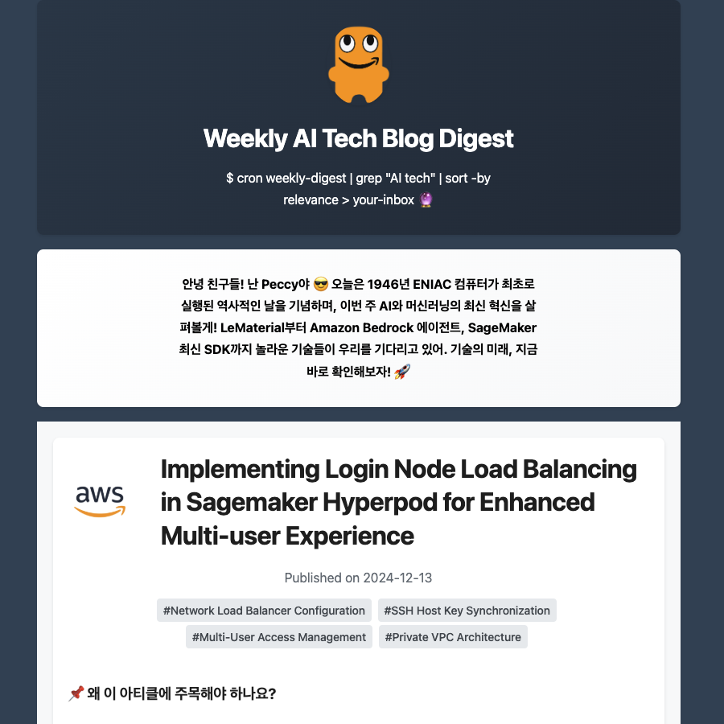

<div align="center">

# 🤖 Weekly AI Tech Blog Digest

**An automated newsletter that curates, filters, summarizes, and emails the week's best AI/ML engineering posts.**

Powered by Amazon Bedrock (Claude) · orchestrated on AWS, defined with the CDK.

[](https://github.com/bits-bytes-nn/tech-digest/actions/workflows/ci.yml)


-green)

🇰🇷 [한국어 README](./README.ko.md)



</div>

---

## ✨ Features

- **AI-powered curation**. Claude (via Amazon Bedrock) scores each post for
  relevance and writes a structured, multi-section summary.
- **Multi-source aggregation**. pulls from ~20 tech blogs via RSS and resilient
  HTML scraping (AWS, Google, Meta, OpenAI, Anthropic, NVIDIA, and more), with
  SSRF-guarded requests and per-source health tracking.
- **Content quality gate**. drops posts whose visible text is too thin to
  summarize *before* they reach the LLM, so the digest never ships empty write-ups.
- **Skimmable cards**. every article leads with a one-sentence takeaway and a
  reading-time estimate, and the highest-scoring piece leads the issue.
- **Clip-budget aware**. mail clients truncate a message over ~100 KB. The
  summary length budget and the template's markup weight are both tuned to stay
  under it, and the build warns if an issue would be cut.
- **Crawl-health monitoring**. tracks every source's fetch status and raises an
  SNS alert when a source fails, so silent breakage surfaces fast — with an
  allow-list for sources that are known to fail from AWS egress IPs, so the alarm
  stays actionable.
- **Serverless infrastructure**. AWS Lambda *or* Batch (config-selectable),
  scheduled by EventBridge, defined as code with the AWS CDK.
- **Professional email**. responsive HTML templates with dark-mode support,
  per-source logos, score badges, captioned figures and fully localized chrome
  (KO/EN), delivered through Amazon SES.
- **Measured, not guessed**. two rubric harnesses steer tuning instead of taste:
  one scores the *filter* (does the right article get picked?) and one scores the
  *output* (is the write-up any good?). Every output check is deterministic and
  maps onto a specific prompt rule, so a low score says which instruction to fix.
- **Reproducible builds**. base images pinned by digest *and* all 71 Python
  dependencies pinned in `app/requirements.lock`, which CI applies as a
  constraints file so the suite tests exactly what the image ships.
- **Attributable cost**. on-demand Bedrock carries no taggable resource, so the
  pipeline invokes through tagged application inference profiles and logs token
  usage per pipeline stage.

---

## 📐 Documentation

**AWS architecture** — infrastructure & data flow:


**Processing pipeline** — ingestion → delivery:


---

## 🏗️ Architecture

### Core components

| Module | Responsibility |
| --- | --- |
| `feed_parser.py` | RSS parsing + resilient HTML scraping (BeautifulSoup4 / Selenium), per-source health tracking |
| `summarizer.py` | Content gate → relevance filter → rank/cap → summarize, all via Bedrock |
| `model_factory.py` | Bedrock model capability registry + LangChain chat-model construction, cost-attribution profiles |
| `quality_metrics.py` | Deterministic output-quality rubric (pure functions) |
| `eval_metrics.py` | Filtering-score metrics (pure functions) |
| `newsletter_renderer.py` | HTML generation with Jinja2 (responsive, dark-mode, localized, size-checked) |
| `aws_helpers.py` | S3, SES, SNS, SSM, and Batch operations |

### Pipeline

```
collect → gate → filter → rank → summarize → greet → render → deliver
```

### Infrastructure

- **Lambda / Batch**. execution environment selected by `lambda_or_batch`.
- **EventBridge**. scheduled execution (default: Saturdays 01:00 UTC).
- **S3**. config, recipients, generated newsletters, and article HTML.
- **SSM Parameter Store**. LangChain API key and Batch queue/definition names.
- **SES**. newsletter delivery. **SNS** — run/health notifications.
- **Bedrock (us-west-2)**. Claude Sonnet 5 (filter + summarize), Claude
  Haiku 4.5 (greeting). Any model in the `LanguageModelId` catalog is
  selectable per stage, including **Claude Opus 5** (`anthropic.claude-opus-5`);
  `thinking_effort` accepts `xhigh`/`max` on the Opus tier.

---

## 🛠️ Tech Stack

- **Language / IaC:** Python 3.12+, AWS CDK, Docker
- **AI:** Amazon Bedrock, LangChain
- **Scraping:** Feedparser, BeautifulSoup4, Selenium
- **Rendering / config:** Jinja2, Pydantic, YAML

---

## 📋 Configuration

Create `app/configs/config-{stage}.yaml` (e.g. `config-dev.yaml`). The four
top-level sections map to the Pydantic models in
[`app/configs/config.py`](./app/configs/config.py):

```yaml
resources:
  project_name: tech-digest
  stage: dev
  lambda_or_batch: batch
  cron_expression: "cron(0 1 ? * 6 *)"   # Saturdays 01:00 UTC

scraping:
  min_content_length: 600                # drop posts thinner than this (visible chars)
  expected_flaky_urls:                   # fetch failures here are reported, not alerted
    - "x.ai/news"
  rss_urls:
    - "https://aws.amazon.com/blogs/amazon-ai/feed/"
    - "https://www.amazon.science/index.rss"

summarization:
  filtering_model_id: anthropic.claude-sonnet-5
  summarization_model_id: anthropic.claude-sonnet-5
  greeting_model_id: anthropic.claude-haiku-4-5-20251001-v1:0
  min_score: 0.7                         # keep posts scoring >= this
  max_posts: 5                           # cap kept posts (applied before summarizing)
  max_per_source: 2                      # optional diversity cap; unfilled slots are
                                         # backfilled, so it never shrinks the issue

newsletter:
  sender: "your-verified-sender@example.com"
  header_title: "Weekly AI Tech Blog Digest"
```

> Model IDs come from the `LanguageModelId` catalog in
> [`app/src/constants.py`](./app/src/constants.py).

---

## 🚀 Usage

### Deploy infrastructure

```bash
python scripts/deploy_infra.py
python scripts/put_inference_profiles.py --stage dev   # once per account/stage
```

### Bedrock cost attribution

On-demand Bedrock bills against no taggable resource, so `InvokeModel` token spend
cannot carry a cost-allocation tag — in a shared account the Bedrock line is one
unattributable total. An **application inference profile** *is* taggable, and invoking
through its ARN attributes the usage.

`scripts/put_inference_profiles.py` creates one per configured model, named
`{project}-{stage}-{model-slug}` and tagged `Project`/`Stage`, copied from the
system-defined cross-region profile so the same routing is inherited.
`BedrockCrossRegionModelHelper` prefers them at resolution time — the single place every
model build already goes through. A missing profile or a denied lookup silently keeps
the system-defined id: cost reporting must never stop a generation.

Two things to know:

- `application-inference-profile` is a **different IAM resource type** from
  `inference-profile`. The policy grants both; dropping the former makes every Bedrock
  call `AccessDenied` the moment a profile exists.
- Activate the `Project` cost allocation tag in **Billing → Cost allocation tags** for
  this to reach Cost Explorer (up to 24h, and **not** retroactive).

Complementing it, each stage names itself when building its model, so every call logs
`LLM usage stage=... model=... input=... output=... cache_read=... cache_write=...` —
the bill is per model, while filtering, summarization, output-fixing and the greeting
share just two of them.

### Run locally

```bash
# Install runtime dependencies
pip install -r requirements.txt

# Configure environment
cp .env.template .env        # then edit .env

# Generate and send a digest for a given week
python app/main.py --end-date 2026-06-03 --recipients you@example.com

# Or submit it as a Batch job
python app/run_batch.py --end-date 2026-06-03 --language ko --recipients you@example.com
```

### Test & quality gates

```bash
# Install dev tooling (ruff, mypy, pytest)
pip install -e ".[dev]"

# Lint, format-check, type-check, and test
ruff check .
ruff format --check .
cd app && mypy .             # run from app/ so the dual import layout resolves;
                             # `.` (not `src`) also checks main.py / run_batch.py
pytest                       # fast, offline unit/integration suite (461 tests, 83% cov)

# Output-quality rubric over a generated run — deterministic, no AWS, no cost.
# Each dimension maps onto one summarization-prompt rule, so a low score says
# which instruction to change. --compare diffs two runs to verify a prompt edit.
python scripts/eval_summary_quality.py --date 2026-08-19
python scripts/eval_summary_quality.py --compare 2026-08-18 2026-08-19
```

These same checks run in CI on every push and pull request
([`.github/workflows/ci.yml`](./.github/workflows/ci.yml)).

---

## 📄 License

MIT
