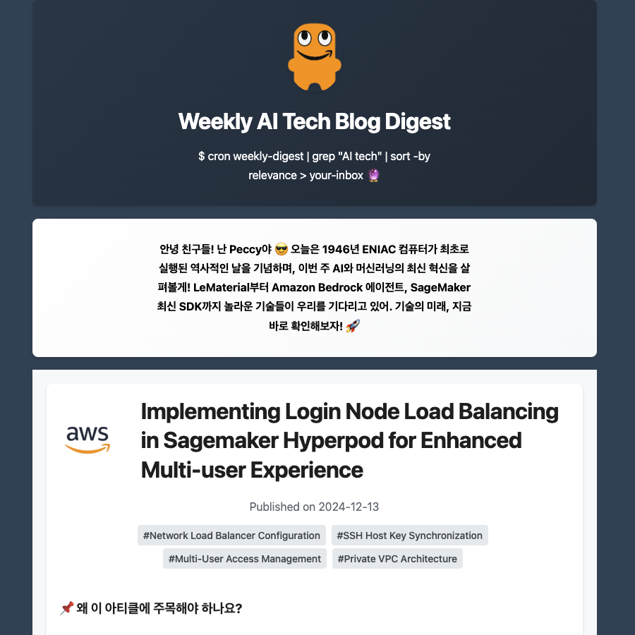

## 🤖 Weekly AI Tech Blog Digest

Automated newsletter service that curates and delivers AI tech insights from leading blogs using AWS services and AI-powered content filtering.



### ✨ Features

- **AI-Powered Curation**: Uses Amazon Bedrock (Claude models) for content filtering and summarization
- **Multi-Source Aggregation**: Monitors 15+ tech blogs (AWS, Google, Meta, OpenAI, Anthropic, etc.)
- **Automated Infrastructure**: AWS Lambda/Batch with EventBridge scheduling
- **Professional Email**: HTML templates with responsive design and company logos

### 🏗️ Architecture

#### Core Components
- **Feed Parser** (`feed_parser.py`): RSS/web scraping with BeautifulSoup4
- **Summarizer** (`summarizer.py`): AI filtering and summarization via Bedrock
- **Newsletter Renderer** (`newsletter_renderer.py`): HTML generation with Jinja2
- **AWS Helpers** (`aws_helpers.py`): S3, SES, and Batch operations

#### Infrastructure
- **Lambda/Batch**: Configurable execution environment
- **EventBridge**: Scheduled execution (default: Saturdays 1 AM UTC)
- **S3**: Asset storage and configuration
- **SES**: Email delivery

### 🛠️ Tech Stack

- Python 3.12+, AWS CDK, Docker
- Amazon Bedrock, LangChain, Feedparser
- BeautifulSoup4, Selenium, Jinja2
- Pydantic validation, YAML configuration

### 📋 Configuration

Create `app/configs/config-{stage}.yaml`:

```yaml
resources:
  project_name: tech-digest
  stage: dev
  lambda_or_batch: batch
  cron_expression: "cron(0 1 ? * 6 *)"

summarization:
  filtering_model_id: anthropic.claude-sonnet-4-5-20250929-v1:0
  summarization_model_id: anthropic.claude-sonnet-4-5-20250929-v1:0
  min_score: 0.8
  max_posts: 5

newsletter:
  sender: "your-email@example.com"
  header_title: "Weekly AI Tech Blog Digest"
```

### 🚀 Usage

#### Infrastructure Deployment
```bash
# Deploy infrastructure
python scripts/deploy_infra.py
```

#### Development
```bash
# Install dependencies
pip install -r requirements.txt

# Set up environment
cp .env.template .env
# Edit .env with your configuration

# Run locally
python app/main.py --end-date 2024-01-01 --recipients aldente0630@gmail.com

# Submit batch job
python app/run_batch.py --end-date 2024-01-01 --language ko --recipients aldente0630@gmail.com
```