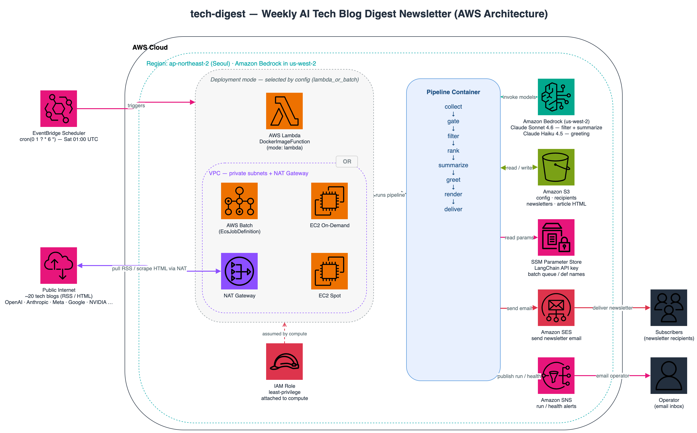

# Tech Digest — 기술 문서

> **주간 AI 기술 블로그 다이제스트** 뉴스레터 서비스의 상세 라인-바이-라인 기술
> 레퍼런스입니다. 이 문서는 프로젝트의 단일한 심층 기술 출처이며 지속적으로
> 갱신됩니다. 상위 수준의 사용법은 루트 `README.md`를 참고하세요.

**최종 갱신:** 2026-06-05

---

## 목차

1. [시스템 개요](#1-시스템-개요)
2. [아키텍처 다이어그램](#2-아키텍처-다이어그램)
3. [저장소 구조](#3-저장소-구조)
4. [설정 (`app/configs/`)](#4-설정-appconfigs)
5. [상수 & Enum (`app/src/constants.py`)](#5-상수--enum-appsrcconstantspy)
6. [크롤링 & 파싱 (`app/src/feed_parser.py`)](#6-크롤링--파싱-appsrcfeed_parserpy)
7. [크롤러 헬스 추적](#7-크롤러-헬스-추적)
8. [Bedrock 모델 팩토리 & 배치 처리 (`app/src/utils.py`)](#8-bedrock-모델-팩토리--배치-처리-appsrcutilspy)
9. [프롬프트 & 프롬프트 캐싱 (`app/src/prompts/prompts.py`)](#9-프롬프트--프롬프트-캐싱-appsrcpromptspromptspy)
10. [필터링 & 요약 (`app/src/summarizer.py`)](#10-필터링--요약-appsrcsummarizerpy)
11. [콘텐츠 충분성 게이트](#11-콘텐츠-충분성-게이트)
12. [인사말 생성 (`app/src/greeter.py`)](#12-인사말-생성-appsrcgreeterpy)
13. [뉴스레터 렌더링 (`app/src/newsletter_renderer.py`)](#13-뉴스레터-렌더링-appsrcnewsletter_rendererpy)
14. [이메일 템플릿 (`app/templates/`)](#14-이메일-템플릿-apptemplates)
15. [AWS 헬퍼 (`app/src/aws_helpers.py`)](#15-aws-헬퍼-appsrcaws_helperspy)
16. [오케스트레이션 (`app/main.py`)](#16-오케스트레이션-appmainpy)
17. [배치 제출 (`app/run_batch.py`)](#17-배치-제출-apprun_batchpy)
18. [인프라 코드 (`scripts/deploy_infra.py`)](#18-인프라-코드-scriptsdeploy_infrapy)
19. [컨테이너 (`app/Dockerfile-*`)](#19-컨테이너-appdockerfile-)
20. [테스트 & CI/CD](#20-테스트--cicd)
21. [로컬 vs AWS 차이](#21-로컬-vs-aws-차이)
22. [운영 런북](#22-운영-런북)
23. [알려진 한계 & 향후 과제](#23-알려진-한계--향후-과제)

---

## 1. 시스템 개요

Tech Digest는 AI/ML 엔지니어링 블로그 글을 매주 큐레이션해 이메일로 전달하는
스케줄 기반 서버리스 파이프라인입니다. 주 1회 **Amazon EventBridge** 규칙이
발동하면, 컨테이너화된 Python 애플리케이션이(설정에 따라 **AWS Lambda** 또는
**AWS Batch**에서) 다음을 수행합니다.

1. **수집(Collect)** — 약 20개 소스(RSS 피드 + 피드가 없는 사이트용 맞춤형 HTML
   스크레이퍼)에서 후보 글을 모읍니다.
2. **게이트(Gate)** — 본문이 너무 빈약해 요약 품질이 나오지 않을 글을 걸러냅니다.
3. **필터(Filter)** — LLM(Amazon Bedrock / Claude)이 각 글의 ML 연구 관련성과
   품질을 점수화합니다.
4. **랭킹(Rank)** — 점수로 정렬해 상위 *N*개만 남깁니다.
5. **요약(Summarize)** — 생존한 글마다 또 한 번의 Claude 호출로 구조화된 HTML
   설명(태그·참고 링크 포함)을 만듭니다.
6. **인사말(Greet)** — 짧고 친근한 "Peccy" 인사말을 생성합니다.
7. **렌더(Render)** — Jinja2로 다크모드·점수 배지를 갖춘 반응형 HTML 이메일을
   만듭니다.
8. **전달(Deliver)** — **Amazon SES**로 이메일을 보내고, 산출물을 **S3**에
   보관하며, 실행 요약 + 크롤 헬스 리포트를 **Amazon SNS**로 발행합니다.

설계는 **우아한 성능 저하**(graceful degradation)를 우선합니다. 개별 소스·글·LLM
호출이 실패해도 전체 실행이 중단되지 않으며, 실패는 조용히 삼켜지지 않고 SNS
알림으로 표면화됩니다.

---

## 2. 아키텍처 다이어그램

**AWS 아키텍처** (인프라 & 데이터 흐름):



**처리 파이프라인** (수집 → 전달):


AWS 다이어그램은 EventBridge 트리거, Lambda-또는-Batch 컴퓨트 선택, 블로그 소스에
도달하기 위한 VPC/NAT 송신 경로, Bedrock/S3/SSM/SES/SNS 연동을 보여줍니다.
파이프라인 다이어그램은 8단계 순차 처리를 보여주며, **콘텐츠 게이트**("기사가
너무 짧아 요약 불가" 반복 실패의 수정 지점)와 **소스별 헬스 추적**을 강조합니다.

---

## 3. 저장소 구조

```
tech-digest/
├── app/
│   ├── main.py                  # 오케스트레이션 / Lambda+Batch 진입점
│   ├── run_batch.py             # Batch 잡 제출 및 대기 CLI
│   ├── Dockerfile-lambda        # Lambda 런타임 이미지 (브라우저 없음)
│   ├── Dockerfile-batch         # Batch 이미지 (Python 3.12 + Chrome)
│   ├── configs/
│   │   ├── config.py            # Pydantic 설정 모델 + YAML 로더
│   │   ├── config-template.yaml # 주석 달린 템플릿 (커밋됨)
│   │   ├── config-ci.yaml       # CI 전용 synth 검증 설정 (커밋됨)
│   │   ├── config-dev.yaml      # 개발 설정 (gitignore)
│   │   └── config-prod.yaml     # 운영 설정 (gitignore)
│   ├── src/
│   │   ├── feed_parser.py       # 수집: RSS + 맞춤 스크레이퍼 + 헬스
│   │   ├── summarizer.py        # 콘텐츠 게이트 + LLM 필터 + LLM 요약
│   │   ├── greeter.py           # LLM 인사말 생성기
│   │   ├── newsletter_renderer.py # Jinja2 렌더 + Selenium HTML→이미지
│   │   ├── aws_helpers.py       # S3 / SES / SNS / SSM / Batch 헬퍼
│   │   ├── utils.py             # Bedrock 모델 팩토리, BatchProcessor, 파서
│   │   ├── constants.py         # Enum (모델, 경로, 환경변수, 소스)
│   │   ├── logger.py            # 로깅 + AWS 환경 감지
│   │   └── prompts/prompts.py   # 필터링 / 요약 / 인사말 프롬프트
│   ├── templates/               # Jinja2 HTML 이메일 파셜
│   └── assets/                  # 런타임 로고 + 수신자 파일
├── scripts/deploy_infra.py      # AWS CDK 스택 (Lambda/Batch + IAM + 스케줄)
├── tests/                       # pytest 스위트
├── assets/                      # 문서 (이 파일 + 다이어그램)
├── pyproject.toml               # 도구 설정: ruff, mypy, pytest
└── .github/workflows/ci.yml     # CI: lint, type-check, test, cdk synth
```

> **임포트 경로 주의.** 두 가지 레이아웃이 공존합니다. 저장소 루트에서는
> `app.configs` / `app.src`가 임포트됩니다(`config.py`, `deploy_infra.py`,
> 테스트가 사용). 컨테이너의 `WORKDIR=/app` 안에서는 `configs` / `src`가
> 임포트됩니다(`main.py`, `run_batch.py`가 사용). 테스트 스위트는 `app.*`로
> 표준화하며 `tests/conftest.py`가 저장소 루트를 `sys.path`에 추가합니다.

---

## 4. 설정 (`app/configs/`)

설정은 스테이지별 YAML 파일에서 로드되는, 타입이 지정되고 검증되는 Pydantic
트리입니다. `config.py`는 다섯 개의 모델을 정의합니다.

### `BaseModelWithDefaults`
`set_defaults_for_none_fields` 모델 밸리데이터를 가진 작은 베이스 클래스로,
명시적으로 `None`인 필드를 선언된 기본값으로 교체합니다. 덕분에 YAML에서 키를
비워둬도(`profile_name:`) 합리적인 기본값을 얻습니다(순수 Pydantic은 명시적
`None`에 대해 이를 해주지 않습니다). 일반 기본값(`field.default`)과
**`default_factory`**(리스트·딕트 필드, 예: `rss_urls`/`logos`/`included_topics`)
양쪽을 처리하므로, `logos: null` 같은 명시적 null이 `None`으로 새지 않고 `{}`·`[]`로
복원됩니다.

### `Resources`
배포/런타임 정체성:
- `project_name`(필수, 비어 있으면 안 됨), `stage`(`dev`|`prod`).
- `profile_name` — 로컬 AWS 프로파일(AWS에서는 무시).
- `default_region_name`(기본 `ap-northeast-2`)와 `bedrock_region_name`
  (기본 `us-west-2`) — Bedrock은 스택의 다른 부분과 다른 리전에 있는 경우가 많음.
- `s3_bucket_name`(필수), `s3_prefix`(선택적 키 프리픽스).
- `vpc_id` / `subnet_ids` — 선택. 둘 다 설정하면 기존 VPC를 임포트, 아니면 새로
  생성.
- `lambda_or_batch` — 컴퓨트 모드 선택.
- `cron_expression` — 엄격한 EventBridge cron 정규식으로 검증.

### `Scraping`
- `rss_urls` — 소스 목록(피드 및 스크레이퍼 랜딩 페이지).
- `days_back`(기본 7, ≥1) — 조회 기간.
- `min_content_length`(기본 600, ≥0) — **콘텐츠 충분성 임계값**(§11 참고). 마크업을
  제거한 가시 텍스트 길이가 이보다 짧으면 요약 전에 제외됩니다. 기본값 600은 RSS
  요약 스텁(보통 300~500자)과 실제 본문을 가르는 경험적 경계입니다. **주의:** 토큰이
  아닌 *문자 수* 기준이라, 같은 정보를 더 적은 글자로 표현하는 CJK(한국어·중국어·
  일본어) 소스(kakao·ncsoft·qwen 등)는 동일 임계값에서 더 공격적으로 걸러질 수
  있습니다. CJK 위주로 크롤링한다면 단계별로 300~400으로 낮추세요.

### `Summarization`
- `use_filtering` — LLM 관련성 필터 토글.
- `filtering_criteria` — `all` 또는 `amazon`(프롬프트 변형 선택).
- `included_topics` / `excluded_topics` — 필터 방향 조정.
- `filtering_model_id` / `summarization_model_id` / `greeting_model_id` —
  Bedrock 모델 ID(Claude). 기본값은 Sonnet 4.6 / Sonnet 4.6 / Haiku 4.5.
- `filtering_enable_thinking` / `summarization_enable_thinking` — 해당 단계의
  확장 사고(extended thinking) 활성화.
- `max_concurrency`(기본 10) — Bedrock 요청 동시성.
- `min_score`(기본 0.7, 0–1) — 관련성 컷오프.
- `max_posts`(선택) — 다이제스트 글 개수 상한.

### `Newsletter`
- `send_emails`, `save_articles`, `convert_to_images` — 출력 토글.
- `sender`(검증된 이메일), `header_*` / `footer_title` 문자열.
- `logos` — 소스 → 로고 URL 매핑(템플릿에 주입).

### `Config.load()`
환경변수 `CONFIG_FILE_SUFFIX`(`dotenv` 로드, 보통 스테이지명)를 읽어 `config.py`
옆의 `config-{suffix}.yaml`을 로드합니다. `from_yaml`이 파일을 파싱해 검증된
트리를 구성합니다.

---

## 5. 상수 & Enum (`app/src/constants.py`)

- **`AutoNamedEnum`** — `auto()` 멤버가 자기 이름을 소문자로 만드는 `str, Enum`
  베이스(`Language.KO.value == "ko"`).
- **`EnvVars`** — 앱이 읽는 모든 환경변수 이름을 한곳에(리전명, 설정 suffix,
  LangChain 키, 로그 레벨, SNS 토픽 ARN).
- **`FilteringCriteria`** — `ALL` | `AMAZON`; 필터링 프롬프트 선택.
- **`Language`** — `EN` | `KO`; 요약/인사말 언어 선택.
- **`LanguageModelId`** — Bedrock Claude 모델 ID 카탈로그. 최신 모델(Sonnet 4.6,
  Opus 4.6/4.7/4.8, Haiku 4.5)이 레거시와 공존하며, 활성 기본값은 Sonnet 4.6(필터·
  요약)과 Haiku 4.5(인사말)입니다. 새 모델은 여기와
  `_LANGUAGE_MODEL_INFO`(`utils.py`) 양쪽에 추가하세요.
- **`LocalPaths`** — 디렉터리 및 파일명 상수(inputs, outputs, logs, templates,
  recipients).
- **`SSMParams`** / **`S3Paths`** — SSM 파라미터 suffix와 S3 프리픽스.
- **`AppConstants`** — `NULL_STRING = "null"`(Batch가 "값 없음"으로 전달하는
  센티넬; Batch 파라미터는 진짜 빈 값일 수 없음), 그리고 스크레이퍼 라우팅에
  쓰는 URL 패턴 조각의 `External` enum.

---

## 6. 크롤링 & 파싱 (`app/src/feed_parser.py`)

가장 크고 방어적인 모듈입니다. URL 목록을 중복 제거·날짜 필터링된 `Post` 객체
리스트와 헬스 리포트로 변환합니다.

### `ScraperConfig`
중앙화된 튜닝 노브(모두 `ClassVar`): 콘텐츠 CSS 셀렉터, 허용 날짜 포맷, 마크다운
이미지 정규식, 요청 타임아웃, 그리고 핵심적으로:
- **`REQUEST_HEADERS_OPTIONS`** — 현실적인 브라우저 헤더 세트 3종. 첫 번째는
  `Sec-Fetch-*`, `Sec-Ch-Ua`, `Upgrade-Insecure-Requests`를 포함한 완전한
  Chrome 131 프로파일 — 이는 `User-Agent`만 있는 요청을 거부하는 안티봇 필터
  (Meta, Medium)의 `403`을 실질적으로 줄여줍니다.
- **`SOURCE_MAPPING`** — 도메인/핸들 → 표준 소스명. 표준 도메인뿐 아니라 Medium
  퍼블리케이션 슬러그/`@`핸들(`netflix-techblog`, `palantir`,
  `pinterest_engineering`)도 포함해 Medium 호스팅 피드가 올바른 로고로 매핑됩니다.

### `HeaderCache`
도메인 → 마지막으로 성공한 헤더 세트 인덱스를 매핑하는 프로세스 전역 클래스 레벨
캐시. 같은 호스트에 대한 반복 요청이 시도 루프를 건너뜁니다.

### `SourceFetchError`
소스를 **전혀** 가져올 수 없을 때(네트워크 오류, 안티봇 차단, HTTP 오류) 발생.
성공적으로 가져왔지만 기간 내 글이 없는 경우와 구별됩니다. 컬렉터는 이 구분으로
소스를 `FAILED` vs `EMPTY`로 분류합니다(§7).

### `_try_request` / `_make_robust_request`
`_try_request`는 단일 GET을 수행하며 *일시적* 실패(타임아웃, `429`, `5xx`)에 1회
재시도합니다. `_make_robust_request`는 캐시된(직전 성공) 헤더 세트를 먼저 시도하고
나머지로 폴스루하며, 성공 시 인덱스를 캐시하고 응답을 반환, 모두 실패하면 `None`을
반환합니다. 이전의 중복된 캐시-경로/루프 로직을 통합한 것입니다.

**SSRF 가드** — 요청 전 대상 호스트를, 그리고 리다이렉트 후 *최종* 랜딩 호스트를
`_is_blocked_host`로 검사합니다. 사설/루프백/링크로컬/예약 IP 리터럴(특히 클라우드
메타데이터 엔드포인트 `169.254.169.254`)은 거부하고, 리다이렉트는 `MAX_REDIRECTS`(5)로
제한합니다. 크롤 대상은 설정 화이트리스트(`rss_urls`)지만, 소스가 내부 주소로
리다이렉트하는 경우를 막습니다(IP 리터럴 한정 — 호스트명 DNS 리바인딩까지는 방어하지
않음).

### `Post` (Pydantic 모델)
필드: `title`, `link`, `published_date`, `content`, `images`, `source`,
`summary`, `tags`, `urls`, `score`.
- `validate_tags`는 태그를 **첫 등장 순서를 보존**하며 중복 제거 후 상한 적용
  (`dict.fromkeys`). 모델이 관련도 높은 순으로 태그를 나열하므로, 알파벳 정렬은
  중요한 태그가 단지 늦게 정렬된다는 이유로 잘려나가게 해 쓰지 않습니다.
- `from_entry`는 `feedparser` 엔트리로부터 `Post`를 구성: 콘텐츠 추출, 소스 판정,
  날짜 파싱, 이미지 수집.
- **`_extract_content_from_entry`** — 피드 인라인 콘텐츠가 있으면 사용하고,
  `ScraperConfig.MIN_CONTENT_LENGTH`(원시 HTML 3000자)보다 짧으면 본문 페이지를
  폴백 스크레이핑합니다. (주의: 이건 폴백 페치를 *트리거하는* 원시-HTML 임계값이고,
  실제로 빈약한 글을 다이제스트에서 *제외하는* 가시-텍스트 `min_content_length`
  게이트(§11)와는 별개입니다.)
- **`text_length()`** — 글의 **가시** 텍스트 길이를 반환(BeautifulSoup로 마크업
  제거). 콘텐츠 게이트가 측정하는 값으로, 내비/스크립트/스타일 보일러플레이트
  때문에만 큰 페이지를 빈약하다고 올바르게 판정합니다.
- `_determine_source` — Medium을 특별 처리(퍼블리케이션 슬러그 또는 `@`핸들,
  대소문자 무시)한 뒤 도메인 조회로 폴백.
- `_extract_images` — ``(절대 URL로 변환)와 마크다운 이미지 URL을
  수집하며 `http(s)`만 유지.

### 날짜 헬퍼
- `try_parse_published_date` — **fail-closed** 파서: ISO-8601 우선, 이후 알려진
  포맷 목록 시도, 실패하면 `None` 반환. 모든 날짜-윈도우 게이트(RSS·제너릭·사이트별
  스크레이퍼)가 이걸 써서, 날짜를 못 읽은 글은 "현재"로 간주돼 매주 다이제스트에
  섞이는 대신 *제외*됩니다.
- `parse_published_date` — `try_parse_published_date`를 감싸 실패 시 "현재"로
  폴백하는 변형. 정렬 키가 항상 필요한 `Post` 구성에만 쓰고, 포함 여부 판정에는
  쓰지 않습니다.
- `is_date_in_range` — UTC로 정규화 후 포함 비교.

### 페처 (Protocol 뒤의 Strategy 패턴)
`PostFetcher`는 `source_url`과 `fetch(start, end)`를 요구하는 `Protocol`.
- **`RssFetcher`** — `force_ipv4()` 안에서 `feedparser`로 피드 파싱(일부 호스트가
  AWS에서 IPv6로 오작동). 엔트리가 없는 피드의 비인코딩 bozo 오류는 진짜 실패로
  보고 `SourceFetchError`를 발생시킵니다. 인코딩 경고만은 허용합니다.
- **`BasePageScraper`** — HTML 스크레이퍼 베이스. `_fetch_page`가 랜딩 페이지를
  가져와 파싱하고 요청 실패 시 **`SourceFetchError`를 발생**시킵니다(차단된
  스크레이퍼가 조용히 빈 결과가 아니라 보고되도록).
- **`GenericPageScraper`** — 템플릿 메서드 베이스: 서브클래스가 `ITEM_SELECTOR`
  설정 및 `_parse_item` 구현.
- 사이트별 스크레이퍼: `GoogleBlogScraper`, `LinkedInBlogScraper`,
  `QwenBlogScraper`(제너릭 기반)와 `AnthropicBlogScraper`, `MetaAIBlogScraper`,
  `XAIBlogScraper`(구조가 빈약한 사이트용 맞춤 링크/날짜 휴리스틱).

### `ScraperRegistry`
URL 패턴 조각을 스크레이퍼 클래스에 매핑. `get_fetcher`가 URL에 맞는 스크레이퍼를
반환하거나 `RssFetcher`로 폴백. `create_fetchers`가 설정된 URL들의 페처 목록 구성.

### `PostCollector`
`from_urls`가 페처를 구성. `collect_posts`가 각 페처를 실행하고 링크로 중복 제거,
소스별 헬스 기록, 한 줄 요약 로깅, 최신순 정렬된 글 반환.

---

## 7. 크롤러 헬스 추적

"소스가 실제로 동작하나?", "왜 로컬은 되고 AWS는 안 되나?"라는 운영 질문에 답하기
위해 추가했습니다.

- **`SourceStatus`** — `OK`(가져와 글 생성), `EMPTY`(가져왔지만 기간 내 글 없음 —
  오래된 피드일 수 있음), `FAILED`(가져오기 자체 오류).
- **`SourceHealth`** — 소스별 레코드: `url`, `fetcher`, `status`, `post_count`,
  `error`.
- **`CrawlReport`** — `SourceHealth`들을 집계. `failed` / `empty` / `ok` 파티션,
  `total_posts`, `summary_line()`(`"18 ok, 2 empty, 1 failed (34 posts)"`),
  `format_alert()`(실패 소스와 오류를 나열하는 사람이 읽는 리포트)를 제공.

`PostCollector.collect_posts`가 실행하며 `CrawlReport`를 채웁니다. `main.py`에서
AWS 실행 중 소스가 하나라도 `FAILED`면 전용 SNS 알림을 즉시 발행
(`_send_crawl_health_alert`)하고, 성공 알림에도 `summary_line()`을 포함합니다.
이로써 깨진 소스(예: 데이터센터 IP에서만 발동하는 안티봇 차단 — §21 참고)가
조용히 다이제스트에서 사라지는 대신 실행 가능한 이메일을 만듭니다.

---

## 8. Bedrock 모델 팩토리 & 배치 처리 (`app/src/utils.py`)

### `LanguageModelInfo`와 `_LANGUAGE_MODEL_INFO`
모델별 역량 메타데이터 레지스트리(컨텍스트 윈도우, 최대 출력 토큰, 프롬프트 캐싱/
사고/성능 최적화/1M 컨텍스트 지원). 팩토리가 이를 참조해 요청을 검증하고 기능을
안전하게 활성화합니다.

### `BaseBedrockModelFactory` (제너릭 ABC)
적절한 타임아웃, 적응형 재시도, 커넥션 풀을 갖춘 boto3 `bedrock-runtime`
클라이언트를 구성. 서브클래스가 서비스명, info dict, 모델 생성 로직을 제공.

### `BedrockCrossRegionModelHelper`
가능하면 모델 ID를 **크로스 리전 추론 프로파일**로 해석합니다 — 먼저 `global.*`
프로파일, 그다음 리전(`us.*`/`apac.*`)을 시도하고 없으면 순수 모델 ID로 폴백.
이것이 동일 설정을 여러 리전에서 돌릴 수 있게 합니다. `list_inference_profiles`를
조회합니다.

### `BedrockLanguageModelFactory`
`get_model`은 (가능하면 크로스 리전인) 모델 ID를 해석하고, `ChatBedrockConverse`
(크로스 리전 또는 사고) vs `ChatBedrock` 사용 여부를 결정한 뒤 설정을 구성합니다:
온도(사고 시 1.0 강제), 검증된 `max_tokens`, 선택적 1M 컨텍스트 베타 플래그,
선택적 성능 최적화 레이턴시 모드, 선택적 사고 예산. Converse/비Converse 경로의
기능 적용 차이를 헬퍼 메서드가 캡슐화합니다.

### `BatchProcessor` (Pydantic 모델)
동시 LLM 호출을 **배치 우선, 순차 폴백** 전략으로 구동: 작업을 청크로 나눠 제한된
동시성으로 LangChain `.batch()`를 시도하고, 청크 실패 시 항목별 재시도(tenacity
지수 백오프)로 폴백합니다. 진행률은 `tqdm`로 표시. 필터링과 요약 양쪽의 회복력
계층입니다. *(이전에 쓰이지 않던 async 변형은 데드코드로 제거되었습니다.)*

### `HTMLTagOutputParser`
모델 텍스트에서 명명된 태그를 추출하는 LangChain 출력 파서. 단일 태그명이면 내부
텍스트를, 리스트면 태그→내부 HTML dict를 반환. 구조화된 필드(`score`, `reason`,
`summary`, `tags`, `urls`)를 모델 출력에서 뽑아내는 방식입니다.

### `RetryableBase`
구성된 tenacity 재시도 데코레이터를 노출하는 믹스인. `Greeter`가 사용.

### 기타 헬퍼
`validate_email(s)` / `validate_emails(list)`(정규식 기반), `get_date_range`
(선택적 종료일 + 조회 기간으로 윈도우 계산), `measure_execution_time`(sync/async
타이밍 데코레이터).

---

## 9. 프롬프트 & 프롬프트 캐싱 (`app/src/prompts/prompts.py`)

### `BasePrompt`
system/human 템플릿과 선언된 입력/출력 변수를 담는 frozen 데이터클래스.
`__post_init__`이 모든 선언된 입력 변수가 실제로 템플릿에 나타나는지 검증합니다.
`get_prompt(enable_prompt_cache)`가 LangChain `ChatPromptTemplate`을 만듭니다.

**프롬프트 캐싱(활성화됨).** 프롬프트 캐싱은 *프리픽스 매칭*입니다 — 변하는
`{post}`보다 앞에 오는 부분만 캐시됩니다. 원래 거대한 정적 루빅스는 human
템플릿의 `{post}` *뒤*에 있어 근본적으로 캐시 불가능했습니다. 그래서:

- 각 프롬프트는 `cache_split_marker`(필터링은 `**EVALUATION PROCESS:**`, 요약은
  `**CORE PRINCIPLES:**`)를 선언합니다.
- `enable_prompt_cache=True`이고 마커가 있으면, `get_prompt`가 마커 이후의 정적
  지시문을 캐시되는 **system 프리픽스**로 옮기고, 변하는 데이터(`{post}`)만 human
  메시지에 남깁니다. **텍스트를 복제하지 않습니다** — human 템플릿이 단일 출처로
  유지되며 빌드 시점에 분할됩니다.
- 두 Bedrock 백엔드는 **서로 호환되지 않는** 캐시 마커를 쓰므로, `get_prompt`는
  실제로 실행될 백엔드에 맞는 **하나만** 내보냅니다(`use_converse` 플래그로 분기).
  `ChatBedrockConverse`는 끝의 `{"cachePoint": {"type": "default"}}` 블록을,
  `ChatBedrock`은 텍스트 블록의 `cache_control: {ephemeral}`를 받습니다. 주의:
  `cachePoint` 블록이 `ChatBedrock` 요청의 system content에 들어가면
  `ValueError("System message content item must be type 'text'")`로 요청 빌드
  시점에 크래시하므로 둘을 동시에 넣지 않습니다. `Summarizer`가 생성된 LLM
  인스턴스 타입(`isinstance(..., ChatBedrockConverse)`)을 보고 플래그를 전달합니다.
- 결과적으로 요약 system 프리픽스 ~1,350 토큰이 모든 글에 걸쳐 바이트-동일하게
  유지되어 캐시 히트가 발생합니다. 필터링 프리픽스는 루빅스 단순화(과적합 제거) 후
  ~1,020-1,030 토큰으로, Bedrock 최소 캐시 단위(~1,024 토큰) 경계에 걸쳐 있어
  필터링 캐시 히트는 보장되지 않습니다(요약 캐시는 확실히 동작). 한 번 실행에
  소수의 글만 처리하는 워크로드라 캐시 효과는 본질적으로 제한적입니다.
- 캐싱은 모델의 `supports_prompt_caching` 역량에 따라 켜집니다(Summarizer가 모델
  정보를 보고 결정). 정적 프리픽스에 변하는 값을 두면 매 호출 캐시가 무효화되므로,
  토픽 목록 같은 실행-안정 변수는 마커 *앞*(human)에 두고, 루빅스의 방향 표현
  ("listed above" 등)은 위치 중립적으로 수정했습니다.

### `FilteringPrompt`
`for_criteria`로 선택되는 두 변형(`ALL`, `AMAZON`). 토픽 관련성을 검증하고
`score`(0.00–1.00), `reason`, 정규화된 `title`을 명명 태그로 내도록 지시합니다.

**재현성을 위한 앵커 기반 점수제(튜닝됨).** 이전 루빅스는 수십 개의 가산 미세
모디파이어(±0.02/0.03)를 쌓는 방식이라 과적합되어 있었고, LLM이 그 산술을
일관되게 재현하지 못해 점수가 흔들렸습니다. 이를 **이산 앵커 점수**(0.05 단위
그리드: 0.85/0.80/0.70/0.60/0.50/0.35/0.15/0.05)에서 하나를 고르고 최대 ±0.05 한
단계만 조정하는 방식으로 단순화했습니다. 더불어 `filtering_enable_thinking`를
dev/prod에서 **False**로 두어(확장 사고는 temperature=1.0을 강제) temperature=0의
결정적 점수를 보장합니다. 요약은 사고를 유지합니다(점수와 무관). 임계값 의미
(`min_score`)는 그대로입니다.

### `SummarizationPrompt`
`for_language`로 선택되는 `EN` / `KO` 변형. 다섯 섹션(왜 중요한가, 아키텍처, 기술
심층 분석, 성과, 향후)으로 구성된 사실 기반 HTML 전용 요약과 `tags`, 참고 `urls`를
요청합니다. **섹션 생략 규칙**이 원문이 뒷받침하지 않는 섹션을 생략하게 해 "정보
없음" 같은 빈 섹션을 방지합니다.

### `GreetingPrompt`
"Peccy" 페르소나. `for_language`로 EN/KO 선택. 짧은(50–70 단어) 평문 인사말 생성.

---

## 10. 필터링 & 요약 (`app/src/summarizer.py`)

### `SummaryOutput` (Pydantic)
모델의 요약 출력을 검증: 마크다운을 HTML로 변환(스타일용 클래스 주입 포함) 후
**HTML 새니타이즈**, 태그 정규화(첫 등장 순서 보존 중복 제거/상한/기본값), URL
정규화(마크다운·HTML 링크·평문 URL → 이스케이프된 앵커).
- **`_sanitize_html`** — 요약은 Jinja `|safe`로 렌더되는 **신뢰 경계**이므로,
  허용 목록(구조·인라인 태그) 외의 태그는 언랩하고 `<script>`/`<style>`는 제거,
  이벤트 핸들러(`on*=`)·`style` 등 비허용 속성과 `javascript:`/`data:` 스킴
  href/src를 제거합니다. 클래스 주입(`code`/`pre`/`table`) *후*에 돌려 허용
  클래스가 살아남습니다.
- **`_normalize_urls` / `_is_safe_url`** — href 스킴을 `http`/`https`/`mailto`로
  화이트리스트하고 href·텍스트를 모두 이스케이프합니다. 마크다운 링크·기존 `<a>`
  태그·평문 URL을 모두 동일하게 정규화하며, 비허용 스킴 항목은 렌더하지 않고
  버립니다.

### `Summarizer`
- `__init__`에서 두 LangChain 체인 구성: **필터**(`prompt | llm |
  HTMLTagOutputParser`)와 **요약기**(`prompt | llm |
  OutputFixingParser(HTMLTagOutputParser)`, 후자는 저렴한 Haiku "수정" 모델로
  잘못된 출력을 복구). 두 체인 모두 모델이 지원하면 **프롬프트 캐싱을 켭니다**(§9).
- 공개 진입점이자 품질의 단일 초크 포인트인 **`process_posts`**: ① **콘텐츠
  게이트**(§11) → ② 선택적 관련성 필터링 → ③ **점수 랭킹 + `max_posts` 캡** →
  ④ 요약 순으로 처리합니다. 캡을 **요약 전**에 적용하는 것이 핵심입니다 — 요약이
  가장 비싼 LLM 단계이므로, 버려질 글을 요약하느라 Bedrock 비용을 낭비하지 않습니다.
  거친 앵커 점수로 동점이 잦으므로 2차 정렬 키로 게시일(최신 우선)을 써 결정적으로
  타이를 깹니다.
- **`_gate_by_content_length`** — 빈약한 글을 제외하고 (사유와 함께)
  `filtered_out_posts`에 기록해 실행 알림에 나타나게 합니다.
- **`_filter_posts`** — 필터 체인을 배치 실행, 각 `score`/`reason` 파싱, `min_score`
  이상인 글을 유지, 나머지를 제외 항목으로 기록. 점수 파싱이 실패한 글도
  `filtered_out_posts`에 기록해 리포트에서 누락되지 않게 합니다(조용한 손실 방지).
- **`_summarize_posts`** — 요약 체인을 배치 실행, 각 글에 `summary`/`tags`/`urls`를
  기록하며 결과를 `_postprocess_summary`로 통과.
- **`_postprocess_summary`** — 두 가지 결정적 수정을 적용: ① 한글 종결 콜론→마침표
  (`_KO_TERMINAL_COLON`) — 종결 음절+콜론이 **닫는 태그나 문자열 끝 앞**일 때만
  교정해, 리스트를 도입하는 정상 콜론(`…같습니다: 첫째`)이나 비율(`3:1`)은 보존.
  ② 소스 호스트 별칭 정규화(`_HOST_ALIASES`). 오타 교정 휴리스틱과 호스트 별칭이라는
  서로 다른 의도를 명시적으로 분리했습니다. (요약 프롬프트에도 "문장을 콜론으로
  끝내지 말 것" 지시를 두어 원천에서 줄입니다.)

---

## 11. 콘텐츠 충분성 게이트

**문제.** 가끔 요약기에 도달한 "글"의 가독 본문이 거의 없었습니다(티저, 링크만
있는 항목, 보일러플레이트가 대부분인 페이지). 그러면 요약기가 실패하거나 거의 빈
요약을 냈습니다 — "기사가 너무 짧아 글을 못 씀" 증상입니다.

**수정.** `Summarizer.process_posts` 맨 앞의 게이트:

1. `Post.text_length()`가 HTML을 제거하고 **가시** 문자 수를 측정.
2. `scraping.min_content_length`(기본 **600**) 미만 글을 제외.
3. 제외된 각 글을 사유와 함께 `filtered_out_posts`에 기록해 SNS 실행 요약에 보고
   (조용히 사라지지 않음).

게이트가 필터와 요약기 *앞*에서 동작하므로, 필터링 활성화 여부와 무관하게 빈약한
글은 LLM에 도달할 수 없습니다. 임계값은 스테이지별로 설정 가능합니다. 이 로직은
`tests/test_content_gate.py`로 커버됩니다.

---

## 12. 인사말 생성 (`app/src/greeter.py`)

`Greeter`는 설정된 언어로 `prompt | llm | StrOutputParser` 체인을 구성하고
`greet(context)`를 노출하며, `RetryableBase` 재시도 데코레이터로 감쌉니다. 인사말
모델은 보통 저렴한 Haiku 티어입니다.

---

## 13. 뉴스레터 렌더링 (`app/src/newsletter_renderer.py`)

### 모델
`Article`, `Header`, `Section`, `Footer`, `NewsletterData` — 타입이 지정된 뷰
모델. `Article`은 날짜를 검증하고 점수를 0–1로 제한하며, 접근성 alt 텍스트에 쓰는
`source_label` 프로퍼티를 노출합니다. `validate_date`는 다양한 입력 날짜 포맷을
`YYYY-MM-DD`로 강제 변환합니다.

### `NewsletterRenderer`
**autoescape 켜진** Jinja2 `Environment`를 감쌉니다(요약 HTML은 의도적으로 `|safe`
필터로 렌더). `|safe`로 빠져나가는 요약·URL은 업스트림 `SummaryOutput`에서 이미
새니타이즈·스킴 검증을 거치므로(§10 `_sanitize_html`/`_normalize_urls`), 이 신뢰
경계는 모델/원문이 주입한 스크립트나 `javascript:` 링크로부터 보호됩니다. 전체
뉴스레터 또는 단일 글을 렌더합니다.

### `HtmlToImageConverter`
HTML을 스크린샷하는 선택적 Selenium/Chrome 렌더러(단일/분할 페이지). 이제 Chrome/
Chromium 바이너리가 없으면(`chrome_available()`) 모호한 WebDriver 오류 대신 실행
가능한 메시지와 함께 **즉시 실패**합니다 — Lambda에 브라우저가 없는 경우(§21)의
가드입니다. `PATH`/`CHROMEDRIVER_PATH`의 `chromedriver`를 우선하고 `CHROME_BINARY`를
존중하며, 로컬 개발에서만 `webdriver-manager`로 폴백합니다.

### `NewsletterBuilder`
날짜별 글 JSON을 로드하고 소스별 로고를 붙인 뒤 뉴스레터 HTML(및 선택적 글별
HTML/이미지)을 렌더해 출력 경로를 반환합니다. 동작은 `BuildConfiguration`으로
구동됩니다.

---

## 14. 이메일 템플릿 (`app/templates/`)

테이블 기반 HTML 이메일(클라이언트 호환성 최대화)로, Jinja2 파셜을 조립:
`template.html`(셸 + CSS), `header_section.html`, `first_section.html`(인사말),
`main_contents.html`(글 카드), `footer_section.html`, `article.html`(독립 글).

사용성/디자인 기능:
- **다크모드** — `@media (prefers-color-scheme: dark)` + `color-scheme` 메타
  태그. 카드·텍스트·칩·코드 블록이 모두 반전.
- **관련도 점수 배지** — 날짜 옆에 알약 모양(`★ 0.84`) 렌더. 그라디언트를 벗기는
  클라이언트(Outlook 등)를 위해 단색 `background-color` 폴백 포함.
- **접근성** — `<html>`의 `lang`, 이메일 본문의 `role="article"` + `aria-label`,
  소스명에서 파생한 의미 있는 이미지 alt 텍스트.
- **모바일** — `@media (max-width: 800px)`로 제목·패딩 축소. 코드 블록은 넘치지
  않고 스크롤/줄바꿈.
- **프리헤더** — 받은편지함 미리보기 줄에 인사말 인트로 사용(없으면 제목).

---

## 15. AWS 헬퍼 (`app/src/aws_helpers.py`)

boto3 위의 얇고 로깅이 잘 된 래퍼들로, 우아한 성능 저하에 도움이 되는 곳에서는
예외를 호출자에게 던지지 않고 명확한 성공/실패 신호를 반환합니다:
- `check_and_download_from_s3`, `upload_to_s3` — S3 객체 I/O.
- `get_account_id`, `get_ssm_param_value` — STS/SSM 조회.
- `send_email` — 적절한 MIME 멀티파트 메시지와 생성된 `Message-ID`를 가진 SES
  `send_raw_email`.
- `submit_batch_job`, `wait_for_batch_job_completion` — Batch 제출 + 폴링.

---

## 16. 오케스트레이션 (`app/main.py`)

`handler(event, context)`가 Lambda와 Batch 공통의 단일 진입점입니다. 흐름:
1. 설정 로드. 기본 리전 boto 세션과 Bedrock 리전 boto 세션 구성(로컬에서는
   `profile_name` 반영).
2. `_setup_aws_env` — AWS에서 LangChain API 키를 SSM에서 하이드레이트.
3. **`_fetch_and_filter_posts`** — 수집한 뒤 `Summarizer.process_posts`에
   위임(게이트→필터→랭킹/`max_posts` 캡→요약). 글, 날짜 suffix, 제외 목록,
   그리고 **`CrawlReport`** 를 반환.
4. AWS 실행 중 소스가 실패했으면 크롤 헬스 알림 발행.
5. 생존 글이 없으면 200으로 우아하게 종료.
6. **`_process_posts_and_create_newsletter`** — 글 JSON 영속화, 인사말 생성, HTML
   빌드, 산출물 S3 업로드.
7. 이메일이 활성화되면 수신자 해석(CLI/인자 또는 S3 파일), 수신자별 약간의 간격을
   두고 발송, 성공 알림 발행(크롤 요약과 제외 글 포함).
8. 처리되지 않은 예외 시 실패 알림 발행 후 500 반환.

언어(`Language`)는 `handler` 진입부에서 **한 번** 해석해 필터링·인사말·뉴스레터
빌드·파일명까지 동일하게 전달합니다. 이렇게 해야 `--language en`일 때 요약은 영어인데
인사말만 KO 기본값으로 남는 불일치가 생기지 않습니다.

`__main__` 블록은 `--end-date`, `--language`, `--recipients`를 파싱(`"null"`
센티넬은 부재로 취급)하고 `handler`를 호출합니다.

---

## 17. 배치 제출 (`app/run_batch.py`)

SSM에서 Batch 잡 큐/정의 이름을 조회하고, 정제된 파라미터로(`None`/공백을 `"null"`
센티넬/콤마 결합 수신자로 변환) 잡을 제출한 뒤 완료까지 폴링하는 로컬 CLI.
스케줄을 기다리지 않고 온디맨드 실행을 트리거하는 데 씁니다.

---

## 18. 인프라 코드 (`scripts/deploy_infra.py`)

설정에서 완전히 파라미터화되는 단일 AWS CDK `NewsletterStack`.

- **VPC** — `vpc_id`/`subnet_ids`가 주어지면 기존 VPC 임포트, 아니면 퍼블릭 +
  `PRIVATE_WITH_EGRESS` 서브넷과 NAT 게이트웨이 1개를 가진 2-AZ VPC 생성(블로그
  소스 도달용 송신 경로).
- **IAM(최소 권한)** — 광범위한 `*FullAccess` 매니지드 정책 대신, 역할에 앱이
  실제로 하는 작업에 대한 **범위 지정 인라인 정책**을 부여: 설정 버킷의
  S3 객체/리스트, **설정된 발신자로 제한된**(`ses:FromAddress` 조건) SES 발송, 이
  스택 토픽으로의 SNS publish, 이 프로젝트 파라미터 경로의 SSM 읽기, 관련 리전의
  **Anthropic 파운데이션 모델 + 추론 프로파일 ARN으로 범위 지정된** Bedrock invoke
  (프로파일 탐색은 계정 레벨 유지), 프로젝트 Batch 로그 그룹으로 범위 지정된
  CloudWatch Logs. 유지된 매니지드 정책은 런타임 서비스 실행 역할(Lambda basic/VPC
  exec, 또는 Batch용 ECS-on-EC2 인스턴스 역할)뿐입니다. `s3_bucket_name`이 비면
  (S3를 `*`로 범위 지정하는 대신) 스택이 **fail-closed**로 실패합니다. AWS
  Well-Architected 보안 기둥 개선입니다.
- **SNS** — 토픽, 선택적으로 운영자 이메일 구독.
- **컴퓨트** — `DockerImageFunction`(Lambda) 또는 EC2 온디맨드 + 스팟 컴퓨트
  환경의 Batch 잡 정의 중 하나. 각각 EventBridge 스케줄에 연결.
- **SSM** — LangChain API 키와 Batch 큐/정의 이름 저장.

---

## 19. 컨테이너 (`app/Dockerfile-*`)

- **`Dockerfile-lambda`** — `public.ecr.aws/lambda/python:3.12-x86_64`. **브라우저
  없음**이라 이미지 변환은 여기서 미지원(파일에 문서화, §13의 fail-fast 가드로
  강제).
- **`Dockerfile-batch`** — `ubuntu:24.04`(Python 3.12), `google-chrome-stable`,
  한국어/CJK/이모지 폰트, `xvfb` 설치. `CHROME_BINARY`를 고정해 Selenium이 불안정한
  네트워크 다운로드 없이 맞는 드라이버를 해석. `convert_to_images` 활성화 시 Batch
  사용.

---

## 20. 테스트 & CI/CD

- **`pyproject.toml`** 이 도구를 중앙화: `pytest`(`unit`/`integration`/`live`
  마커 및 importlib 임포트 모드), `ruff`(lint + format), `mypy`.
- **`tests/`** — 빠르고 네트워크 없는 pytest 스위트. 날짜 파싱(fail-closed
  `try_parse_published_date` 포함)/소스/이미지 파싱, **사이트별 스크레이퍼 골든
  테스트**(`tests/fixtures/scrapers/`의 저장 HTML으로 Google·LinkedIn·Qwen·Meta·
  xAI·Anthropic의 제목/링크/날짜-윈도우/내비 필터를 오프라인 고정), 요청 계층(모킹
  세션: 헤더 로테이션·일시 재시도·도메인별 캐시, **SSRF 가드**: 내부 IP 타깃·내부
  리다이렉트 차단), 콘텐츠 게이트, 크롤 헬스 분류, **프롬프트 캐싱 분할**(정적
  프리픽스에 `{post}`가 없고, 백엔드별로 올바른 캐시 마커만 들어가며, 양쪽
  langchain_aws 변환 함수를 실제로 통과하는지), 필터/요약 내부 로직(점수 경계·title
  덮어쓰기·None 응답 정렬·잘못된 출력 처리·`max_posts` 요약-전 캡), thinking budget
  클램프, Bedrock 모델 정보 레지스트리 및 크로스 리전 ID 구성, 설정 검증(명시적
  null→`default_factory` 복원 포함), 요약 정규화/후처리(태그 순서 보존, 종결
  콜론 교정, **HTML 새니타이즈**·**URL 스킴 화이트리스트**의 XSS 가드), **AWS
  헬퍼**(SES MIME 빌드·S3 키/프리픽스·404 분기·Batch 폴링 상태머신, 페이크 boto
  클라이언트), **`run_batch`** 의 `"null"` 센티넬 파라미터 처리·날짜 검증,
  **`main.handler`** 제어 흐름(무-게시물 200 / 예외 500), 엔드투엔드 Jinja2
  렌더링(점수 배지·다크모드·접근성·alt 텍스트), SNS 알림 배선을 커버(240 테스트).
  `conftest.py`가 `sys.path`를 고치고 공유 픽스처를 제공.
- **필터링 점수 평가 하버스** — `scripts/eval_filtering.py`가 라벨링된 평가셋
  (`tests/eval_data/filtering_eval_set.json`)에 대해 결정성·0.05 그리드 준수·
  기대 밴드 일치도를 측정합니다. 메트릭은 `app/src/eval_metrics.py`(순수 함수,
  `tests/test_eval_metrics.py`로 검증)에서 계산합니다. 기본은 **드라이런(비용 0)**,
  `--live`는 운영 `Summarizer` 필터 체인을 그대로 써 실제 Bedrock으로 점수를 매겨
  분포를 출력하고 임계(결정성≥99%, 온그리드≥99%, 밴드≥80%) 미달 시 비정상 종료합니다.
  **라이브 측정 결과(Sonnet 4.6, 사고 OFF, 2026-06):** 결정성 100%(σ=0.000),
  0.05 그리드 준수 100%, 밴드 일치 100% — "재현 가능한 점수" 목표와 앵커 점수제가
  실측으로 확인됨.
- **`.github/workflows/ci.yml`** — push/PR 시: 의존성 설치, `ruff check`,
  `ruff format --check`, **`mypy`**(차단형; 컨테이너 임포트 루트와 맞추려고
  `cd app && mypy src`로 실행), 커버리지 포함 `pytest`, 평가 하버스 **드라이런**.
  별도 잡이 `config-ci.yaml`에 대해 **`cdk synth`**(차단형)를 실행해 인프라가
  컴파일되는지 검증하며, `CDK_SYNTH_DUMMY_AZS=1`로 AWS 자격증명 없이 VPC가
  synth되게 합니다.

---

## 21. 로컬 vs AWS 차이

노트북에서는 되지만 AWS에서 실패할 수 있는 것과 그 이유:

1. **데이터센터 IP 안티봇 차단.** 일부 소스(특히 `ai.meta.com`, `x.ai`, 공격적으로
   레이트 리밋되는 Medium 피드)는 거주지 IP에서는 잘 로드돼도 AWS NAT 송신 IP에는
   `403`/챌린지 페이지를 줍니다. 적용된 완화책: 완전한 브라우저형 헤더(`Sec-Fetch-*`
   포함)와 일시 재시도. 최후의 완화책(기본 비활성): 해당 소스를 거주지 프록시나
   헤드리스 브라우저로 라우팅. 이제 이들은 조용히 사라지지 않고 크롤 헬스 알림에
   `FAILED`로 표면화됩니다.
2. **Lambda에 브라우저 없음.** Lambda 이미지에 Chrome이 없어 `convert_to_images`가
   동작 불가. 변환기가 Batch 사용 또는 기능 비활성화 안내와 함께 즉시 실패.
3. **IPv6 이슈.** 일부 호스트가 AWS에서 IPv6로 오작동하므로 `RssFetcher`가 IPv4를
   강제(`force_ipv4`).
4. **오래된 소스 URL.** 여러 피드가 이전됨(DeepMind → `deepmind.google`, Facebook
   → `engineering.fb.com`, MS Research → `microsoft.com/.../feed`, Netflix →
   Medium). 크로스 호스트 리디렉트 추적에 의존하지 않도록 설정을 표준 URL로
   갱신했습니다.

---

## 22. 운영 런북

- **온디맨드 실행 트리거:** `python app/run_batch.py --end-date YYYY-MM-DD
  --language ko --recipients you@example.com`(Batch), 또는 로컬에서 `python
  app/main.py ...`.
- **"No posts found":** 크롤 헬스 SNS 알림/로그에서 `FAILED` 소스 확인. 날짜
  윈도우(`days_back`)가 최신 글을 포함하는지 확인.
- **소스가 안 보임:** 헬스 리포트의 `FAILED`(페치 오류/안티봇) 또는 `EMPTY`(기간 내
  글 없음/오래된 피드)에서 찾기. 설정 URL 갱신 또는 프록시 뒤로 이동.
- **요약이 비거나 짧음:** 콘텐츠 게이트가 이를 방지하지만, 충실한 글이 제외되면
  `scraping.min_content_length`를 낮추세요.
- **이메일 미전달:** SES 아이덴티티/검증과 발신자 주소 확인. SNS 실패 알림에서 오류
  확인.

---

## 23. 알려진 한계 & 향후 과제

- **강한 안티봇 소스**(x.ai, 때때로 Meta)는 AWS 데이터센터 IP에서 안정적으로
  쓰려면 거주지 프록시나 헤드리스 브라우저가 필요합니다. 현재는 `FAILED`로 보고되며
  SNS 알림에 표면화됩니다(조용히 사라지지 않음).
- **프롬프트 캐싱의 효과는 제한적입니다** — 한 번 실행에 소수의 글만 처리하고
  필터링 프리픽스가 ~1,020-1,030 토큰으로 Bedrock 캐시 최소 단위 경계에 걸칩니다
  (요약 ~1,350은 확실히 캐시). 비용 절감은 본질적으로 작습니다.
- **저빈도 소스**(예: `eugeneyan.com`)는 ACTIVE이나 게시 주기가 낮아 자주 `EMPTY`로
  나타날 수 있습니다 — 제거 대상은 아니고 관찰 대상입니다.
- **커버리지**: 핵심 경로는 테스트됐으나(전체 ~62%), `feed_parser`의 사이트별
  스크레이퍼 내부 휴리스틱과 `newsletter_renderer`의 Selenium 캡처 경로는 라이브
  의존성이 커서 단위 테스트가 얕습니다.
- **평가셋 규모** — 현재 라벨링된 평가셋은 합성 글 6건으로, 회귀 게이트로는
  충분하나 통계적으로 작습니다. 실제 기사 발췌로 확장하면 밴드 경계 보정이
  정밀해집니다. (점수 결정성·그리드·밴드 일치는 라이브로 이미 100% 검증됨 — §20.)

---

*이 문서는 코드와 함께 관리됩니다. 동작을 바꿀 때 같은 변경에서 여기 관련 섹션도
갱신하세요.*
