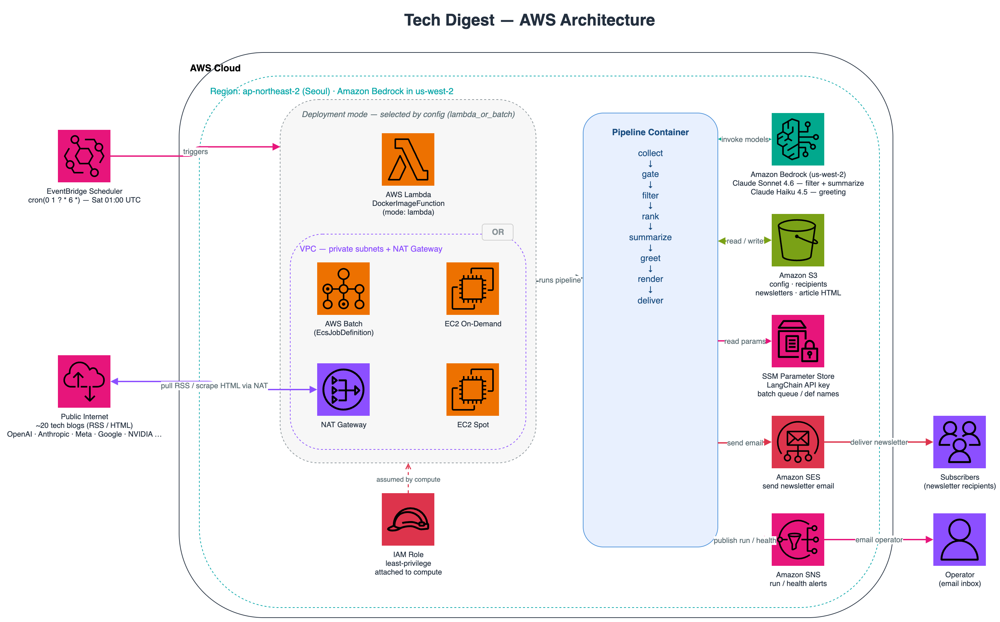
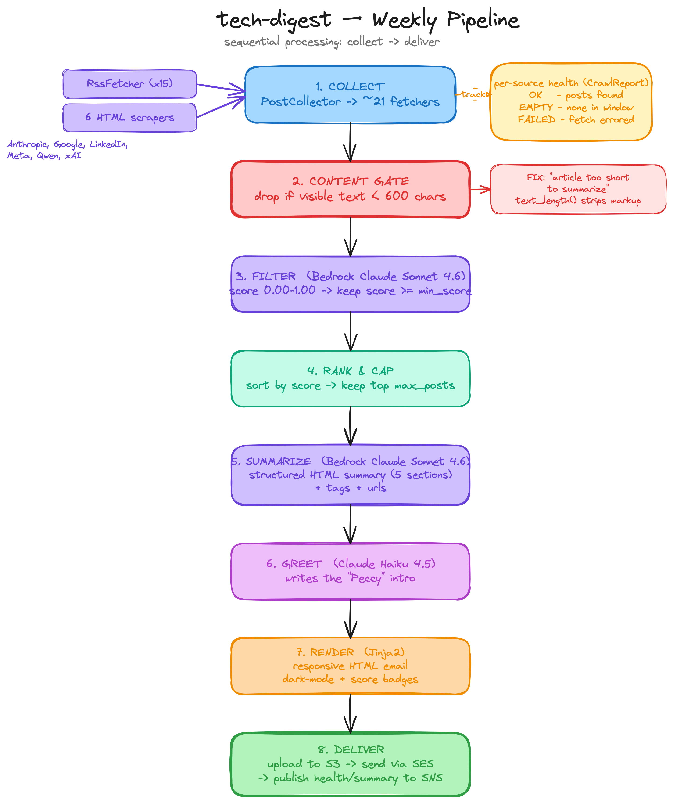

# Tech Digest 설계 문서

주간 AI 기술 블로그 다이제스트를 만들어 메일로 보내는 서비스의 설계 문서입니다.
코드가 왜 그렇게 생겼는지를 설명하는 것이 목적이고, 코드가 바뀌면 이 문서도 같이
바꿉니다. 설치하고 돌려보는 방법은 루트의 `README.md`에 있습니다.

최종 갱신 2026-08-19

## 이 문서를 읽는 방법

앞에서부터 읽을 필요는 없습니다. 대부분은 아래처럼 필요한 데만 들어옵니다.

| 하려는 일 | 볼 곳 |
| --- | --- |
| 전체가 어떻게 돌아가는지 한 번에 보기 | [1. 시스템 개요](#1-시스템-개요), [2. 다이어그램](#2-아키텍처-다이어그램) |
| 크롤링할 블로그 추가·수정 | [6. 크롤링 & 파싱](#6-크롤링--파싱-appsrcfeed_parserpy) |
| 요약 품질이 마음에 안 들 때 | [9. 프롬프트](#9-프롬프트--프롬프트-캐싱-appsrcpromptspromptspy), [10. 필터링 & 요약](#10-필터링--요약-appsrcsummarizerpy) |
| 메일 모양·레이아웃 손보기 | [13. 렌더링](#13-뉴스레터-렌더링-appsrcnewsletter_rendererpy), [14. 템플릿](#14-이메일-템플릿-apptemplates) |
| 새 모델로 갈아타기 | [5. 상수](#5-상수--enum-appsrcconstantspy), [8. 모델 팩토리](#8-bedrock-모델-팩토리-appsrcmodel_factorypy--배치-처리-appsrcutilspy) |
| 비용이 얼마나 드는지, 어디에 쓰이는지 | [8. 모델 팩토리](#8-bedrock-모델-팩토리-appsrcmodel_factorypy--배치-처리-appsrcutilspy), [13. 렌더링](#13-뉴스레터-렌더링-appsrcnewsletter_rendererpy) |
| 메일이 안 왔을 때 | [22. 운영 런북](#22-운영-런북), [7. 크롤러 헬스](#7-크롤러-헬스-추적) |
| 왜 다르게 만들지 않았는지 | [23. 알려진 한계](#23-알려진-한계--향후-과제) |

설명이 길어지는 자리에는 대개 이유가 있습니다. 이 프로젝트에서 고쳐 온 버그가
대부분 **조용히 잘못되는** 종류였기 때문입니다. 소스 하나가 막혀도 실행은 성공으로
끝나고, 요약이 실패해도 메일은 나가고, 점수가 흔들려도 아무 로그도 남지 않습니다.
그래서 "이런 실수를 했었다"까지 같이 적어 두었습니다. 다시 같은 데를 밟지 않으려는
기록이라고 보시면 됩니다.

## 목차

1. [시스템 개요](#1-시스템-개요)
2. [아키텍처 다이어그램](#2-아키텍처-다이어그램)
3. [저장소 구조](#3-저장소-구조)
4. [설정 (`app/configs/`)](#4-설정-appconfigs)
5. [상수 & Enum (`app/src/constants.py`)](#5-상수--enum-appsrcconstantspy)
6. [크롤링 & 파싱 (`app/src/feed_parser.py`)](#6-크롤링--파싱-appsrcfeed_parserpy)
7. [크롤러 헬스 추적](#7-크롤러-헬스-추적)
8. [Bedrock 모델 팩토리 (`model_factory.py`) & 배치 처리 (`utils.py`)](#8-bedrock-모델-팩토리-appsrcmodel_factorypy--배치-처리-appsrcutilspy)
9. [프롬프트 & 프롬프트 캐싱 (`app/src/prompts/prompts.py`)](#9-프롬프트--프롬프트-캐싱-appsrcpromptspromptspy)
10. [필터링 & 요약 (`app/src/summarizer.py`)](#10-필터링--요약-appsrcsummarizerpy)
11. [콘텐츠 충분성 게이트](#11-콘텐츠-충분성-게이트)
12. [인사말 생성 (`app/src/greeter.py`)](#12-인사말-생성-appsrcgreeterpy)
13. [뉴스레터 렌더링 (`app/src/newsletter_renderer.py`)](#13-뉴스레터-렌더링-appsrcnewsletter_rendererpy)
14. [이메일 템플릿 (`app/templates/`)](#14-이메일-템플릿-apptemplates)
15. [AWS 헬퍼 (`app/src/aws_helpers.py`)](#15-aws-헬퍼-appsrcaws_helperspy)
16. [오케스트레이션 (`app/main.py`)](#16-오케스트레이션-appmainpy)
17. [배치 제출 (`app/run_batch.py`)](#17-배치-제출-apprun_batchpy)
18. [인프라 코드 (`scripts/deploy_infra.py`)](#18-인프라-코드-scriptsdeploy_infrapy)
19. [컨테이너 (`app/Dockerfile-*`)](#19-컨테이너-appdockerfile-)
20. [테스트 & CI/CD](#20-테스트--cicd)
21. [로컬 vs AWS 차이](#21-로컬-vs-aws-차이)
22. [운영 런북](#22-운영-런북)
23. [알려진 한계 & 향후 과제](#23-알려진-한계--향후-과제)

---

## 1. 시스템 개요

Tech Digest는 AI/ML 엔지니어링 블로그의 새 글을 매주 모아 골라 읽고, 요약해서
메일로 보내 주는 파이프라인입니다. 사람이 손대는 부분은 없습니다.

매주 정해진 시각에 Amazon EventBridge가 파이프라인을 깨웁니다. 그러면 컨테이너로
패키징된 Python 애플리케이션이 AWS Lambda나 AWS Batch 위에서 (설정에서 고릅니다)
다음 여덟 단계를 차례로 밟습니다.

1. **수집** 약 20개 소스에서 후보 글을 모읍니다. RSS 피드가 있으면 그대로 쓰고,
   피드가 없는 사이트는 전용 HTML 스크레이퍼로 긁어옵니다.
2. **게이트** 본문이 너무 빈약해서 제대로 된 요약이 나올 수 없는 글을 미리
   걸러냅니다. LLM을 부르기 전에 거르는 것이 핵심입니다.
3. **필터** Claude가 글마다 ML 연구 관련성과 품질을 점수로 매깁니다.
4. **랭킹** 점수 순으로 정렬해 상위 몇 개만 남깁니다. 이 순서가 그대로 메일의
   카드 순서가 됩니다.
5. **요약** 남은 글마다 Claude를 한 번 더 불러, 한 문장 리드와 태그와 참고 링크를
   갖춘 HTML 설명을 만듭니다.
6. **인사말** "Peccy"가 건네는 짧은 인트로를 생성합니다.
7. **렌더** Jinja2로 반응형 HTML 메일을 조립하고, 크기가 클립 한계 안인지 확인합니다.
8. **전달** Amazon SES로 발송하고, 산출물을 S3에 보관하고, 실행 요약과 크롤 헬스
   리포트를 Amazon SNS로 알립니다.

설계에서 가장 중요하게 잡은 원칙은 두 가지입니다.

첫째, **한 군데가 실패해도 전체가 멈추지 않습니다.** 소스 하나가 막히거나, 글 하나가
이상하거나, LLM 호출 하나가 실패해도 나머지는 그대로 발행됩니다.

둘째, **실패를 조용히 삼키지 않습니다.** 첫 번째 원칙만 있으면 아무 일도 없었던 것처럼
빈 메일이 나가거나, 메일이 아예 안 나가는데도 실행은 성공으로 기록됩니다. 실제로 이
프로젝트에서 고친 버그의 대부분이 그런 종류였습니다. 그래서 무엇이 어떻게 실패했는지는
반드시 SNS 알림이나 로그로 드러나게 해 두었습니다.

---

## 2. 아키텍처 다이어그램

**AWS 아키텍처** (인프라 & 데이터 흐름):



**처리 파이프라인** (수집 → 전달):



AWS 다이어그램이 전체 그림을 보여줍니다. EventBridge 트리거, Lambda냐 Batch냐를
가르는 컴퓨트 선택, 블로그 소스까지 나가기 위한 VPC/NAT 송신 경로, 그리고
Bedrock·S3·SSM·SES·SNS 연동까지. 파이프라인 다이어그램은 여덟 단계가 어떻게
이어지는지를 따라가며, 특히 **콘텐츠 게이트**("기사가 너무 짧아 요약 불가" 문제를
바로잡은 지점)와 **소스별 헬스 추적**을 강조합니다.

---

## 3. 저장소 구조

```
tech-digest/
├── app/
│   ├── main.py                  # 오케스트레이션 / Lambda+Batch 진입점
│   ├── run_batch.py             # Batch 잡 제출 및 대기 CLI
│   ├── Dockerfile-lambda        # Lambda 런타임 이미지 (브라우저 없음)
│   ├── Dockerfile-batch         # Batch 이미지 (Python 3.12 + Chrome)
│   ├── configs/
│   │   ├── config.py            # Pydantic 설정 모델 + YAML 로더
│   │   ├── config-template.yaml # 주석 달린 템플릿 (커밋됨)
│   │   ├── config-ci.yaml       # CI synth 검증 (Lambda 경로, 커밋됨)
│   │   ├── config-ci-batch.yaml # CI synth 검증 (Batch 경로, 커밋됨)
│   │   ├── config-dev.yaml      # 개발 설정 (gitignore)
│   │   └── config-prod.yaml     # 운영 설정 (gitignore)
│   ├── src/
│   │   ├── feed_parser.py       # 수집: RSS + 맞춤 스크레이퍼 + 헬스
│   │   ├── summarizer.py        # 콘텐츠 게이트 + LLM 필터 + LLM 요약
│   │   ├── greeter.py           # LLM 인사말 생성기
│   │   ├── newsletter_renderer.py # Jinja2 렌더 + Selenium HTML→이미지
│   │   ├── aws_helpers.py       # S3 / SES / SNS / SSM / Batch 헬퍼
│   │   ├── model_factory.py     # Bedrock 모델 레지스트리 + 모델 생성
│   │   ├── eval_metrics.py      # 필터 점수 지표 (순수 함수)
│   │   ├── quality_metrics.py   # 출력 품질 루빅스 (순수 함수)
│   │   ├── utils.py             # BatchProcessor, 태그 파서, 알람 포맷, 날짜
│   │   ├── constants.py         # Enum (모델, 경로, 환경변수, 소스)
│   │   ├── logger.py            # 로깅 + AWS 환경 감지
│   │   └── prompts/prompts.py   # 필터링 / 요약 / 인사말 프롬프트
│   ├── templates/               # Jinja2 HTML 이메일 파셜
│   │   ├── _styles.html         # 뉴스레터·단일 글이 공유하는 단일 스타일시트
│   │   ├── main_contents.html   # 공유 아티클 카드 매크로
│   │   ├── template.html        # 뉴스레터 셸
│   │   └── article.html         # 독립 글 셸 (같은 카드·스타일 재사용)
│   ├── assets/                  # 런타임 로고 + 수신자 파일
│   ├── requirements.txt         # 호환 범위 (사람이 편집)
│   └── requirements.lock        # 실제 설치 버전 71개 `==` 고정 (생성물)
├── scripts/
│   ├── deploy_infra.py          # AWS CDK 스택 (Lambda/Batch + IAM + 스케줄)
│   ├── put_inference_profiles.py # 비용 귀속용 애플리케이션 추론 프로파일
│   ├── eval_filtering.py        # 필터 점수 평가 하버스 (--live로 Bedrock)
│   └── eval_summary_quality.py  # 출력 품질 루빅스 (비용 0)
├── tests/                       # pytest 스위트
├── docs/                        # 설계 문서 (이 파일 + 다이어그램)
├── pyproject.toml               # 도구 설정: ruff, mypy, pytest
└── .github/workflows/ci.yml     # CI: lint, type-check, test, cdk synth
```

> **임포트 경로 주의.** 이 프로젝트에는 두 가지 임포트 레이아웃이 공존합니다.
> 저장소 루트에서 실행할 때는 `app.configs` / `app.src`로 임포트하고(`config.py`,
> `deploy_infra.py`, 테스트가 이 경로를 씁니다), 컨테이너 안에서는
> `WORKDIR=/app`이라 `configs` / `src`로 임포트합니다(`main.py`, `run_batch.py`가
> 이 경로를 씁니다). 테스트 스위트는 `app.*` 한쪽으로 통일했고,
> `tests/conftest.py`가 저장소 루트를 `sys.path`에 추가해 이를 맞춥니다.

---

## 4. 설정 (`app/configs/`)

설정은 스테이지별 YAML 파일에서 읽어 들이는, 타입이 지정되고 검증되는 Pydantic
트리입니다. `config.py`는 다섯 개의 모델을 정의합니다.

### `BaseModelWithDefaults`
나머지 모델이 상속하는 작은 베이스 클래스입니다. `set_defaults_for_none_fields`
모델 밸리데이터를 달고 있어, 값이 명시적으로 `None`인 필드를 선언된 기본값으로
되돌립니다. 덕분에 YAML에서 키만 적고 값을 비워둬도(`profile_name:`) 합리적인
기본값을 얻습니다. 순수 Pydantic은 명시적 `None`에 대해서는 기본값을 채워주지
않기 때문에 직접 처리한 것입니다. 일반 기본값(`field.default`)뿐 아니라
리스트·딕트 필드의 `default_factory`(예: `rss_urls`·`logos`·`included_topics`)도
함께 다루므로, `logos: null` 같은 명시적 null이 `None`으로 새지 않고 `{}`나 `[]`로
복원됩니다.

### `Resources`
배포와 런타임의 정체성을 담습니다.
- `project_name`(필수, 비어 있으면 안 됨), `stage`(`dev` 또는 `prod`).
- `profile_name`. 로컬에서 쓸 AWS 프로파일(AWS 위에서는 무시됩니다).
- `default_region_name`(기본 `ap-northeast-2`)과 `bedrock_region_name`
  (기본 `us-west-2`). Bedrock은 스택의 나머지와 다른 리전에 두는 경우가 많아
  따로 둡니다.
- `s3_bucket_name`(필수)과 `s3_prefix`(선택적 키 프리픽스).
- `vpc_id` / `subnet_ids`: 선택. 둘 다 지정하면 기존 VPC를 가져다 쓰고, 아니면
  새로 만듭니다.
- `lambda_or_batch`. 컴퓨트 모드를 고릅니다.
- `cron_expression`. 엄격한 EventBridge cron 정규식으로 형식을 검증합니다.

### `Scraping`
- `rss_urls`. 소스 목록(피드 URL과 스크레이퍼 랜딩 페이지).
- `days_back`(기본 7, 1 이상): 며칠 전까지의 글을 볼지 정하는 조회 기간.
- `min_content_length`(기본 600, 0 이상): **콘텐츠 충분성 임계값**(자세한 내용은
  §11). 마크업을 걷어낸 가시 텍스트의 길이가 이 값보다 짧으면 요약 전에
  제외합니다. 기본값 600은 RSS 요약 스텁(보통 300~500자)과 실제 본문을 가르는
  경험적 경계입니다. 한 가지 주의할 점은 이 기준이 토큰이 아니라 *문자 수*라는
  것입니다. 그래서 같은 정보를 더 적은 글자로 표현하는 CJK(한국어·중국어·일본어)
  소스(kakao·ncsoft·qwen 등)는 동일한 임계값에서 더 공격적으로 걸러질 수
  있습니다. CJK 위주로 크롤링한다면 300~400 정도로 단계적으로 낮춰 보세요.
- `expected_flaky_urls`(기본 `[]`): 페치 실패가 이미 알려져 있고 예상되는
  소스의 URL 부분 문자열 목록. 헬스 리포트에는 그대로 나오지만 크롤 헬스 SNS
  알림의 트리거에서는 제외됩니다(§7). x.ai(때로는 ai.meta.com)는 AWS 송신 IP를
  거의 매 실행 거부하므로, 이를 매주 알림으로 띄우면 운영자가 알람을 무시하게
  되고 그러면 *진짜로* 깨진 소스가 그 뒤에 숨습니다.

### `Summarization`
- `use_filtering`. LLM 관련성 필터를 켜고 끕니다.
- `filtering_criteria`. `all` 또는 `amazon`(어느 프롬프트 변형을 쓸지 고릅니다).
- `included_topics` / `excluded_topics`: 필터의 방향을 미세 조정합니다.
- `filtering_model_id` / `summarization_model_id` / `greeting_model_id`: 단계별 Bedrock 모델 ID(Claude). 기본값은 차례로 Sonnet 5 / Sonnet 5 /
  Haiku 4.5입니다.
- `filtering_enable_thinking` / `summarization_enable_thinking`: 해당 단계에서
  확장 사고(extended thinking)를 켭니다.
- `max_concurrency`(기본 10): Bedrock 요청의 동시성 한도.
- `min_score`(기본 0.7, 0~1): 관련성 컷오프 점수.
- `max_posts`(선택): 다이제스트에 실을 글 수의 상한. 메일 클라이언트가 약 100KB를
  넘는 본문을 자르고 카드 하나가 약 12~16KB이므로, 이 값은 클립 예산과 함께 봐야
  합니다(§13).
- `max_per_source`(선택, 기본 미설정): 한 소스가 한 호에 실을 수 있는 글 수 상한.
  점수 랭킹 **뒤에** 적용하고, 캡 때문에 빈 자리는 랭크 순으로 다시 채우므로
  *어떤* 글이 실리는지만 바뀌고 *몇 편*이 실리는지는 바뀌지 않습니다(§10).
  단일 벤더 다이제스트(`filtering_criteria: amazon`)에서는 소스 집중이 의도이므로
  비워 두고, 넓은 다이제스트에서는 2가 적당합니다.

### `Newsletter`
- `send_emails`, `save_articles`, `convert_to_images`: 출력 동작을 켜고 끄는
  토글.
- `sender`(검증된 발신 이메일), `header_*` / `footer_title` 문자열.
- `logos`. 소스명 → 로고 URL 매핑(템플릿에 주입됩니다).

### `Config.load()`
환경변수 `CONFIG_FILE_SUFFIX`(`dotenv`로 로드하며, 보통 스테이지명)를 읽어
`config.py` 옆에 있는 `config-{suffix}.yaml`을 찾습니다. 그런 다음 `from_yaml`이
그 파일을 파싱해 검증된 설정 트리를 만들어 냅니다.

---

## 5. 상수 & Enum (`app/src/constants.py`)

- `AutoNamedEnum`. `auto()`로 선언한 멤버가 자기 이름을 소문자 값으로 갖게
  하는 `str, Enum` 베이스입니다(`Language.KO.value == "ko"`).
- `EnvVars`. 앱이 읽는 모든 환경변수 이름을 한곳에 모았습니다(리전명, 설정
  suffix, LangChain 키, 로그 레벨, SNS 토픽 ARN).
- `FilteringCriteria`. `ALL` 또는 `AMAZON`. 필터링 프롬프트를 고를 때 씁니다.
- `Language`. `EN` 또는 `KO`. 요약과 인사말의 언어를 정합니다.
- `LanguageModelId`. Bedrock Claude 모델 ID 카탈로그입니다. 최신 모델
  (**Opus 5**, Sonnet 5, Opus 4.6/4.7/4.8, Sonnet 4.6, Haiku 4.5)과 레거시 모델이
  함께 들어 있으며, 현재 활성 기본값은 Sonnet 5(필터·요약)와 Haiku 4.5(인사말)입니다.
  새 모델을 추가할 때는 여기와 `model_factory.py`의 `_LANGUAGE_MODEL_INFO` **양쪽에**
  함께 넣어야 합니다. Claude 5 세대(Opus 5 / Sonnet 5)는 요청 계약이 달라
  `supports_sampling_params=False` + `uses_adaptive_thinking=True`가 **반드시**
  필요하며(§8), 이를 빠뜨리면 모든 호출이 거부되면서도 실행은 정상 종료해 이메일만
  조용히 누락됩니다. 그래서 이 계약을 테스트로 고정해 두었습니다. 사고 깊이는
  `thinking_effort`로 조절하고, `xhigh`/`max`는 **Opus 티어 전용**입니다.
- `LocalPaths`. 디렉터리와 파일명 상수(inputs, outputs, logs, templates,
  recipients).
- `SSMParams` / `S3Paths`: SSM 파라미터 suffix와 S3 프리픽스.
- `AppConstants`. `NULL_STRING = "null"`(Batch가 "값 없음"을 전달할 때 쓰는
  센티넬입니다. Batch 파라미터는 진짜 빈 값을 가질 수 없습니다), 그리고
  스크레이퍼 라우팅에 쓰는 URL 패턴 조각을 담은 `External` enum.

---

## 6. 크롤링 & 파싱 (`app/src/feed_parser.py`)

가장 크고 가장 방어적인 모듈입니다. URL 목록을 받아, 중복을 제거하고 날짜로
거른 `Post` 객체 리스트와 헬스 리포트로 바꿉니다.

### `ScraperConfig`
튜닝 노브를 한곳에 모은 클래스입니다(모두 `ClassVar`). 콘텐츠 CSS 셀렉터, 허용
날짜 포맷, 마크다운 이미지 정규식, 요청 타임아웃을 담고 있고, 핵심은 다음
둘입니다.
- `REQUEST_HEADERS_OPTIONS`. 현실적인 브라우저 헤더 세트 3종. 첫 번째는
  `Sec-Fetch-*`, `Sec-Ch-Ua`, `Upgrade-Insecure-Requests`까지 갖춘 완전한
  Chrome 131 프로파일입니다. `User-Agent`만 달린 요청을 거부하는 안티봇 필터
  (Meta, Medium 등)의 `403`을 실질적으로 줄여 줍니다.
- `SOURCE_MAPPING`. 도메인이나 핸들을 표준 소스명으로 매핑합니다. 일반
  도메인뿐 아니라 Medium 퍼블리케이션 슬러그와 `@`핸들
  (`netflix-techblog`, `palantir`, `pinterest_engineering`)도 포함해, Medium에
  호스팅된 피드가 올바른 로고로 연결되게 합니다. **개인 블로그 3곳**
  (`eugeneyan.com`, `sebastianraschka.com`(+`magazine.` 서브도메인),
  `philschmid.de`)은 설정된 피드인데도 이 맵에 없어서 모두 `unknown`으로
  떨어지고 있었습니다. 로고가 일반 플레이스홀더로 나오는 것보다 더 큰 문제는,
  `source`가 `max_per_source` 다양성 캡의 집계 키라서 서로 다른 저자 셋을 한
  매체로 취급했다는 점입니다(2026-08-19 실행에서 실제로 3편 중 2편이 `unknown`
  이었습니다). 이제 각자 고유한 소스명을 갖고, 밑줄은 `Article.source_label`에서
  공백이 되어 "Sebastian Raschka"처럼 표시됩니다. 로고 항목이 없는 소스는
  `unknown` 로고로 자동 폴백하므로 애셋을 새로 만들지 않아도 됩니다.

### `HeaderCache`
도메인별로 "마지막에 성공한 헤더 세트 인덱스"를 기억하는 프로세스 전역
클래스 레벨 캐시입니다. 같은 호스트에 다시 요청할 때 시도 루프를 건너뛰어
바로 성공했던 헤더를 씁니다.

### `SourceFetchError`
소스를 **아예** 가져오지 못했을 때(네트워크 오류, 안티봇 차단, HTTP 오류)
발생합니다. "가져오기는 성공했지만 기간 안에 글이 없는" 경우와는 구별됩니다.
컬렉터는 이 구분을 근거로 소스를 `FAILED`와 `EMPTY`로 나눕니다(§7).

### `_try_request` / `_make_robust_request`
`_try_request`는 GET 한 번을 보내고, *일시적* 실패(타임아웃, `429`, `5xx`)에는
1회 재시도합니다. `_make_robust_request`는 캐시된(직전에 성공한) 헤더 세트를
먼저 시도하고 안 되면 나머지로 넘어갑니다. 성공하면 그 인덱스를 캐시하고 응답을
돌려주며, 모두 실패하면 `None`을 반환합니다. 예전에 여기저기 흩어져 중복되던
캐시 경로와 루프 로직을 하나로 합친 결과입니다.

**SSRF 가드**. 요청을 보내기 전 대상 호스트를, 그리고 리다이렉트가 끝난 뒤
*최종* 랜딩 호스트를 다시 `_is_blocked_host`로 검사합니다. 사설·루프백·링크로컬·
예약 IP 리터럴(특히 클라우드 메타데이터 엔드포인트 `169.254.169.254`)은
거부하고, 리다이렉트 횟수는 `MAX_REDIRECTS`(5)로 제한합니다. 크롤 대상은
어차피 설정 화이트리스트(`rss_urls`)지만, 그 소스가 내부 주소로 리다이렉트하는
상황을 막기 위한 장치입니다(IP 리터럴까지만 막으며, 호스트명 DNS 리바인딩까지는
방어하지 않습니다).

### `Post` (Pydantic 모델)
필드는 `title`, `link`, `published_date`, `content`, `images`, `source`,
`summary`, `one_liner`, `tags`, `urls`, `score`입니다.

> **`summary`는 피드 티저로 채우지 않습니다.** 이 필드는 LLM 요약이 들어갈 자리이고,
> 하류 코드는 "`summary`가 비어 있지 않다"를 **요약이 성공했다**는 신호로 씁니다
> (`Summarizer.process_posts`, `Article.summary`의 `min_length=1`). 예전에는
> `from_entry`가 `entry.summary`(RSS 티저)로 이 필드를 미리 채웠기 때문에 그 신호가
> 항상 참이었고, 그 결과 **요약 호출이 실패한 글이 원문 RSS 티저를 본문으로 달고
> 발송되면서 동시에 제외 리포트에도 올라가는** 버그가 있었습니다. 이제 티저는
> `content` 추출에만 쓰이고 `summary`는 건드리지 않습니다.
- `validate_tags`는 태그를 처음 등장한 순서를 유지한 채 중복을 제거하고
  상한을 적용합니다(`dict.fromkeys`). 모델이 관련도가 높은 순서대로 태그를
  나열하기 때문에, 알파벳순으로 정렬하면 중요한 태그가 단지 뒤로 밀렸다는 이유로
  잘려 나갈 수 있어 그렇게 하지 않습니다.
- `from_entry`는 `feedparser` 엔트리로부터 `Post`를 만듭니다. 콘텐츠를 뽑고,
  소스를 판정하고, 날짜를 파싱하고, 이미지를 모읍니다.
- `_extract_content_from_entry`. 피드에 인라인 콘텐츠가 있으면 그것을 쓰되,
  가시 텍스트가 `ScraperConfig.FULL_SCRAPE_TEXT_THRESHOLD`(3000자)보다 짧으면 본문
  페이지를 추가로 스크레이핑해 보강합니다. 상수 이름을 `MIN_CONTENT_LENGTH`에서
  바꾼 이유는, 설정의 `scraping.min_content_length`(§11의 ~600자 게이트)와 이름이
  거의 같아 서로 혼동하기 쉬웠기 때문입니다. 이건 폴백 페치를 *촉발하는* 기준이고,
  저쪽은 빈약한 글을 다이제스트에서 실제로 *제외하는* 기준입니다.
- `text_length()`. 글의 **가시** 텍스트 길이를 돌려줍니다(BeautifulSoup로
  마크업 제거). 콘텐츠 게이트가 보는 값이 바로 이것입니다. 그래서 내비게이션·
  스크립트·스타일 같은 보일러플레이트만 많은 큰 페이지를 빈약하다고 올바르게
  판정할 수 있습니다.
- `_determine_source`. Medium을 먼저 특별 처리하고(퍼블리케이션 슬러그나 `@`
  핸들, 대소문자 무시) 그다음 도메인 조회로 넘어갑니다.
- `_extract_images`. ``(절대 URL로 변환)와 마크다운 이미지 URL을 모으며
  `http(s)`만 남깁니다. 이 목록은 예전에 아무도 읽지 않는 죽은 데이터였는데, 지금은
  요약에 들어간 ``의 **출처 검증** 근거로 쓰입니다(§10).

### 날짜 귀속 (`BasePageScraper._find_date_near_element`)
인덱스 페이지 스크레이퍼(Anthropic·Meta·xAI)는 게시물 링크에서 바깥으로 훑으며 날짜를
찾습니다. 까다로운 지점은 여러 게시물을 담은 조상에 도달했을 때입니다. 그 조상 전체에
정규식을 걸면 문서 순서상 **첫 번째** 날짜가 잡히는데, 그건 어느 게시물이 먼저 오느냐에
따라 결정됩니다. 그래서 날짜가 없는 게시물이 이웃의 날짜를 물려받아, 사이트가 준 적
없는 날짜를 달고 주간 윈도우에 들어왔습니다. `try_parse_published_date`가 제공하려던
fail-closed 게이트가 무력화된 것입니다.

수정은 각 단계에서 다른 게시물 링크를 제거한 뒤 검색합니다. 살아남은 날짜는 우리
링크 안에 있거나 공용 chrome에 있는 것이고("Published May 30, 2026" 섹션 제목은 그 아래
모든 게시물에 정당하게 적용됩니다) 둘 다 우리 것이 맞습니다. 오직 형제 게시물 안에만
있던 날짜는 우리 것이 아니므로 계속 올라가거나 포기합니다. 패턴 추측이 아니라
**포함 관계**로 판정하므로 정상 케이스를 깨지 않습니다.

이 로직은 세 스크레이퍼에 **복붙되어 있었습니다**(한쪽을 고쳐도 나머지는 그대로). 이제
베이스 클래스의 단일 구현을 상속하고, 각 스크레이퍼는 `LINK_PATTERN`과 `DATE_PATTERNS`만
선언합니다.

라이브 검증(2026-08-19). 이 수정을 연기했던 이유가 "라이브 HTML 검증 필요"였으므로,
세 사이트 실제 HTML로 확인했습니다: anthropic 9건/고유 날짜 8개, meta 3건/3개,
xai 49건/41개. 특히 xai는 제목에 날짜가 박혀 있어 교차 검증이 가능했는데 **전부 일치**
했고, 수집 건수가 줄지도 않았습니다.

### 날짜 헬퍼
- `try_parse_published_date`. 실패 시 막는(fail-closed) 파서입니다. ISO-8601을
  먼저 시도하고, 안 되면 알려진 포맷 목록을 차례로 시도하며, 끝내 못 읽으면
  `None`을 돌려줍니다. 모든 날짜 윈도우 게이트(RSS·제너릭·사이트별 스크레이퍼)가
  이 함수를 씁니다. 그래서 날짜를 못 읽은 글은 "지금"으로 간주돼 매주 다이제스트에
  슬쩍 끼는 대신 *제외*됩니다.
- `parse_published_date`. `try_parse_published_date`를 감싸되, 실패하면 "지금"으로
  폴백하는 변형입니다. 정렬 키가 항상 있어야 하는 `Post` 구성에만 쓰고, 글을
  포함할지 말지 판단하는 데는 쓰지 않습니다.
- `is_date_in_range`. UTC로 정규화한 뒤 경곗값을 포함해 비교합니다.

### 교차 소스 중복 제거 (`normalize_title_key`)
여러 피드가 **같은 발표**를 서로 다른 URL로 실어 옵니다(`deepmind.google`과
`research.google`은 둘 다 소스 `google`로 매핑되고, AWS 글이 Medium에도 실립니다).
링크만으로 중복을 제거하던 때는 이런 글이 한 호에 똑같은 카드 두 장으로 나갔습니다.
`PostCollector`는 이제 링크와 **정규화한 제목** 둘 다로 중복을 봅니다. 정규화는
대소문자·공백·구두점만 접는 **완전 일치**이며 유사도 점수 같은 건 쓰지 않으므로,
서로 다른 글을 잘못 합칠 수 없습니다. 먼저 만난 쪽을 남기고(피드는 설정 순서대로
순회) 나머지를 버리므로 같은 주라면 항상 같은 결과가 나옵니다. `post_count`는
소스가 *내놓은* 수를 그대로 보고하므로, 중복 제거가 정상 소스를 `EMPTY`처럼
보이게 만들지 않습니다.

### 페처 (Protocol 뒤의 Strategy 패턴)
`PostFetcher`는 `source_url`과 `fetch(start, end)`를 요구하는 `Protocol`입니다.
- `RssFetcher`. `force_ipv4()` 안에서 `feedparser`로 피드를 파싱합니다(일부
  호스트가 AWS에서 IPv6로 붙으면 오작동하기 때문). 엔트리가 하나도 없으면서 인코딩
  문제가 아닌 bozo 오류는 진짜 실패로 보고 `SourceFetchError`를 던집니다. 단순
  인코딩 경고만은 허용합니다.
- `BasePageScraper`. HTML 스크레이퍼의 베이스 클래스입니다. `_fetch_page`가
  랜딩 페이지를 가져와 파싱하고, 요청이 실패하면 `SourceFetchError`를 던집니다
  (차단된 스크레이퍼가 조용히 빈 결과로 끝나지 않고 제대로 보고되도록).
- `GenericPageScraper`. 템플릿 메서드 베이스입니다. 서브클래스가
  `ITEM_SELECTOR`를 설정하고 `_parse_item`만 구현하면 됩니다.
- 사이트별 스크레이퍼: 제너릭 기반의 `GoogleBlogScraper`, `LinkedInBlogScraper`,
  `QwenBlogScraper`와, 구조가 빈약한 사이트를 위해 링크·날짜 휴리스틱을 직접 짠
  `AnthropicBlogScraper`, `MetaAIBlogScraper`, `XAIBlogScraper`가 있습니다.

### `ScraperRegistry`
URL 패턴 조각을 스크레이퍼 클래스에 매핑합니다. `get_fetcher`는 주어진 URL에 맞는
스크레이퍼를 돌려주거나, 맞는 게 없으면 `RssFetcher`로 폴백합니다.
`create_fetchers`는 설정된 URL들로부터 페처 목록을 구성합니다.

### `PostCollector`
`from_urls`가 페처들을 만들고, `collect_posts`가 각 페처를 실행합니다. 그 과정에서
링크로 중복을 제거하고, 소스별 헬스를 기록하고, 한 줄짜리 요약을 로깅한 뒤,
최신순으로 정렬된 글 목록을 반환합니다.

---

## 7. 크롤러 헬스 추적

"이 소스가 실제로 동작하고 있나?", "왜 로컬에서는 되는데 AWS에서는 안 되지?"
같은 운영 질문에 답하려고 추가한 기능입니다.

- `SourceStatus`. `OK`(가져와서 글까지 생성), `EMPTY`(가져왔지만 기간 안에
  글이 없음, 오래된 피드일 수 있습니다), `FAILED`(가져오기 자체가 실패).
- `SourceHealth`. 소스별 레코드: `url`, `fetcher`, `status`, `post_count`,
  `error`.
- `CrawlReport`. `SourceHealth`들을 한데 모읍니다. `failed` / `empty` / `ok`로
  나눠 보여 주고, `total_posts`, 한 줄 요약 `summary_line()`
  (`"18 ok, 2 empty, 1 failed (34 posts)"`), 그리고 실패 소스와 오류를 사람이
  읽기 좋게 정리한 `format_alert()`를 제공합니다.

이 리포트는 `PostCollector.collect_posts`가 실행하면서 채웁니다. AWS에서
실행하다 소스가 하나라도 `FAILED`가 되면, `main.py`가 곧바로 전용 SNS 알림을
발행합니다(`_send_crawl_health_alert`). 덕분에 깨진 소스(예: 데이터센터 IP에서만
발동하는 안티봇 차단, §21)가 다이제스트에서 조용히 사라지는 대신 바로 손쓸 수
있는 이메일이 됩니다.

**알람은 조치 가능해야 합니다.** 다만 x.ai(때로는 ai.meta.com)는 AWS 송신 IP를
사실상 매 실행 거부하므로, 이 경보가 **매주 무조건** 발동하고 있었습니다. 항상
울리는 알람은 아무도 읽지 않는 알람이고, 그러면 *새로* 깨진 소스가 그 뒤에 숨습니다.
그래서 `scraping.expected_flaky_urls`에 적힌 소스는 리포트 본문에는 그대로
나오지만 **트리거에서는 제외**합니다. 실패가 전부 예상된 것이면 알림을 보내지 않고
그 사실만 로그에 남기며, 예상 밖 실패가 하나라도 있으면 정상적으로 발동합니다. 모든 SNS 알림(크롤 헬스, 빈 다이제스트, 부분 실패, 완전
실패)은 `utils.py`의 공통 `format_alarm()` 헬퍼로 통일된 형식(제목
`[<project>] <event> — <STATUS>`, 정렬된 필드, 말미 UTC 타임스탬프)을 갖고, 발행
자체는 `main._publish_alarm()` 한 곳을 지나갑니다(네 경보는 이벤트명과 필드만
다릅니다).
노이즈를 줄이려고 정상 발송 시에는 알림을 보내지 않고, 수신자 일부라도 실패했을
때만 부분 실패 경보를 띄웁니다(이때 크롤 요약 `summary_line()`을 함께 실어 보냅니다).

**빈 다이제스트 경보(`_maybe_send_empty_digest_alert`).** 글은 수집됐지만
(`crawl_report.total_posts > 0`) 필터를 통과한 게 하나도 없으면, 실행은 성공(200)으로
끝나고 이메일은 나가지 않습니다. 이 무증상 실패를 잡기 위한 경보입니다. 탈락 사유를
집계해 함께 실어, 대량 모델 실패(예: 모든 호출이 거부된 Sonnet 5 리그레션, §8)과
단지 엄격했을 뿐인 정상적인 한 주를 수신자가 구분할 수 있게 합니다. 반면 아무것도
수집되지 않은 경우(`total_posts == 0`)는 크롤 헬스 알림이 담당하므로 여기서는 보내지
않습니다.

여기서 "필터를 통과한 게 하나도 없다"에는 **요약 단계 실패**도 포함됩니다.
`_summarize_posts`는 요약이 실패한 글(모델 무응답 또는 검증 실패)을
`filtered_out_posts`에 사유와 함께 기록하고, `process_posts`는 요약이 실제로
채워진 글만 반환합니다. 따라서 세 글이 필터는 통과했으나 요약이 전부 실패하면
`posts`가 비어 이 경보가 발동합니다. 예전처럼 글 없는 뉴스레터를 조용히 보내지
않습니다.

**인프라 레벨 경보.** 위 경보들은 컨테이너/Lambda가 살아서 `handler`의 제어
흐름에 도달해야 발동합니다. 그 이전(초기화 크래시, OOM 등)에 죽는 경우를 위해
스택은 앱 코드와 무관한 CloudWatch/EventBridge 경보를 둡니다: (1) Batch 작업의
FAILED 종료 상태를 EventBridge 규칙으로 잡아 SNS로 전달, (2) Lambda `Errors`
지표 경보, (3) 예약 호출이 재시도 후에도 배달되지 못하면 이벤트를 SQS
데드레터 큐에 넣고 그 큐 깊이에 경보를 걸어, 그 주 다이제스트가 조용히
누락되지 않게 합니다.

---

## 8. Bedrock 모델 팩토리 (`app/src/model_factory.py`) & 배치 처리 (`app/src/utils.py`)

> **모듈 분리.** 모델 팩토리는 원래 `utils.py`에 있었는데, 그 탓에 `utils.py`가
> 838줄로 프로젝트에서 가장 큰 모듈이 되어 "서로 관련 없는 헬퍼 모음"이라는 원래
> 성격을 잃었습니다. 팩토리(레지스트리 + 생성 로직, 약 520줄)를
> `model_factory.py`로 분리해 `utils.py`는 다시 작은 헬퍼 모음(약 340줄)으로
> 돌아갔습니다. mypy 오버라이드도 `src.model_factory`로 함께 옮겼습니다.

### `LanguageModelInfo`와 `_LANGUAGE_MODEL_INFO`
모델별 역량 메타데이터 레지스트리입니다(컨텍스트 윈도우, 최대 출력 토큰, 프롬프트
캐싱·사고·성능 최적화·1M 컨텍스트 지원 여부). 팩토리는 이걸 보고 요청을 검증하고
기능을 안전하게 켭니다.

신세대 모델(Sonnet 5 이상)은 요청 형식이 달라, 두 개의 역량 플래그로 이를 구분합니다:

- `supports_sampling_params`. 신세대 모델은 샘플링 파라미터(`temperature`/`top_k`/
  `top_p`)를 제거했고, 이를 포함한 요청은 `ValidationException`으로 거부합니다. 이
  플래그가 False면 팩토리가 해당 파라미터를 아예 보내지 않습니다(구세대 호환 위해
  기본 True).
- `uses_adaptive_thinking`. 신세대 모델은 명시적 사고 예산
  (`thinking.type="enabled"` + `budget_tokens`) 대신 **적응형 사고**
  (`thinking.type="adaptive"`)만 허용합니다. 사고 깊이는 토큰 예산이 아니라
  `output_config.effort`로 조절합니다. 이 플래그가 True면 팩토리가 적응형 형식으로
  전환합니다.

> **회귀 주의:** 이 두 플래그는 Sonnet 5 전환 시 발생한 무증상 발송 실패
> (필터링 전량 `temperature` 거부 → 통과 글 0건, 그리고 요약 전량
> `thinking.type.enabled` 거부)를 막기 위해 도입됐습니다. 파이프라인은 통과 글이
> 0건이어도 정상 종료(exitCode 0)하므로 Batch는 성공으로 기록하고 이메일만 조용히
>누락됩니다. 새 세대 모델을 추가할 때는 두 플래그를 반드시 함께 설정하세요.

### `BaseBedrockModelFactory` (제너릭 ABC)
적절한 타임아웃, 적응형 재시도, 커넥션 풀을 갖춘 boto3 `bedrock-runtime`
클라이언트를 만듭니다. 서비스명, info dict, 실제 모델 생성 로직은 서브클래스가
채웁니다.

### `BedrockCrossRegionModelHelper`
가능하면 모델 ID를 크로스 리전 추론 프로파일로 해석합니다. 먼저 `global.*`
프로파일을, 그다음 리전 프로파일(`us.*`/`apac.*`)을 시도하고, 둘 다 없으면 순수
모델 ID로 폴백합니다. 이 덕분에 같은 설정을 여러 리전에서 그대로 돌릴 수 있습니다.
프로파일 목록은 `list_inference_profiles`로 조회합니다.

**Bedrock 비용 귀속(신규).** 마지막 단계로, 이 프로젝트의 **애플리케이션 추론
프로파일**이 있으면 그 ARN을 우선합니다. 온디맨드 `InvokeModel`에는 태그를 붙일 수
있는 리소스가 없어서 토큰 사용량에 비용 할당 태그를 실을 방법이 이것뿐이고, 이 계정은
여러 워크로드가 같은 Claude 모델을 공유합니다(실측: 30일 Bedrock 청구가 프로젝트별로
쪼개지지 않는 하나의 총액). 프로파일 이름은 `application_profile_name()`이
`{project}-{stage}-{model-slug}`로 만들며, `scripts/put_inference_profiles.py`와 런타임이
**같은 함수**를 쓰므로 이름이 갈라질 수 없습니다. 조회는 실패해도 그냥 넘어갑니다.
프로파일이 없거나 `ListInferenceProfiles`가 거부되면 원래 쓸 ID를 그대로 씁니다.
비용 리포팅이 생성을 멈추게 해서는 안 됩니다. 없다는 결과도 캐시합니다(안 하면 모델을
만들 때마다 재조회).

> **IAM 함정.** `application-inference-profile`은 `inference-profile`과 **다른 IAM
> 리소스 타입입니다.** 정책에 앞의 것을 넣지 않으면 프로파일이 생성되는 순간부터
> 모든 Bedrock 호출이 `AccessDenied`가 됩니다. 프로파일이 없을 때는 완벽히
> 동작하므로 스크립트를 돌리기 전까지 증상이 나타나지 않습니다.

### `TokenUsageLogger`
모든 LLM 호출의 토큰 사용량을 **어느 단계가 호출했는지**와 함께 로그로 남깁니다.
Cost Explorer는 **모델 단위**로만 청구하는데, 필터링·요약·출력 교정이 같은 모델을
공유하고 인사말과 교정이 또 같은 모델을 공유합니다. 그래서 "Sonnet 5: 입력 4.7M 토큰"
같은 청구서로는 단계별 귀속이 불가능합니다. 특히 **필터링(수집된 글마다 1회, 각각
전문을 실어 보냄)** 은 요약(몇 건)과 비용 형태가 완전히 다릅니다. 이 로그 없이 하는
최적화는 추측입니다. `get_model(stage=...)`로 붙이며, 콜백은 어떤 경우에도 생성을
실패시킬 수 없도록 모든 읽기를 방어적으로 처리합니다.

### `BedrockLanguageModelFactory`
`get_model`은 (가능하면 크로스 리전인) 모델 ID를 해석하고, `ChatBedrockConverse`
(크로스 리전이거나 사고를 켤 때)와 `ChatBedrock` 중 무엇을 쓸지 정한 뒤 설정을
구성합니다. 온도(구세대에서 사고를 켜면 1.0으로 강제하고, 신세대는 온도 자체를 생략),
검증된 `max_tokens`, 선택적 1M 컨텍스트 베타 플래그, 선택적 성능 최적화 레이턴시
모드, 그리고 사고 설정까지. 사고는 모델 세대에 따라 갈립니다: 구세대는
`_apply_budget_thinking`으로 명시적 예산을(예산은 `max_tokens` 미만이 되도록 클램프),
신세대는 `_apply_adaptive_thinking`으로 적응형 형식을 적용합니다. Converse 경로와
비Converse 경로는 기능을 적용하는 방식이 달라서, 그 차이를 헬퍼 메서드가 안으로
감춥니다.

어느 백엔드가 도는지가 **모든 파라미터의 위치**를 결정합니다(Converse는 최상위
kwargs / `additional_model_request_fields`, ChatBedrock은 `model_kwargs` 아래).
Converse가 필요한 조건은 "크로스 리전 프로파일"과 "사고 활성" 두 가지이고, 이를
OR로 묶은 **하나의 플래그**를 헬퍼들에 내려보냅니다. 이 인자는 이제
`use_converse`로 부릅니다. 예전 이름 `is_cross_region`은 전달되는 값과 달라서,
"사고를 켠 비크로스리전 모델은 ChatBedrock 경로로 간다"고 잘못 읽히게 만들었습니다
(값 자체는 처음부터 `use_converse`였으므로 동작 변화는 없고, 이름만 사실과
맞췄습니다).

### `BatchProcessor` (Pydantic 모델)
동시 LLM 호출을 **배치 우선, 순차 폴백** 전략으로 돌립니다. 작업을 청크로 나눠
제한된 동시성으로 LangChain `.batch()`를 시도하고, 청크가 실패하면 항목별로
재시도(tenacity 지수 백오프)하는 방식으로 떨어집니다. 진행률은 `tqdm`로
표시합니다. 필터링과 요약 양쪽 모두에 깔리는 회복력 계층입니다. *(예전에 쓰지
않던 async 변형은 데드코드라 제거했습니다.)*

### `HTMLTagOutputParser`
모델이 내놓은 텍스트에서 이름이 붙은 태그를 뽑아내는 LangChain 출력 파서입니다.
태그명이 하나면 그 안의 텍스트를, 리스트면 "태그명 → 내부 HTML" 딕트를
돌려줍니다. `score`·`reason`·`summary`·`tags`·`urls` 같은 구조화된 필드를 모델
출력에서 꺼내는 방식입니다.

### `RetryableBase`
미리 구성해 둔 tenacity 재시도 데코레이터를 노출하는 믹스인입니다. `Greeter`가
씁니다.

### 기타 헬퍼
정규식 기반의 `validate_email(s)` / `validate_emails(list)`, 선택적 종료일과
조회 기간으로 날짜 윈도우를 계산하는 `get_date_range`, sync/async 양쪽을 재는
타이밍 데코레이터 `measure_execution_time`.

---

## 9. 프롬프트 & 프롬프트 캐싱 (`app/src/prompts/prompts.py`)

### `BasePrompt`

system/human 템플릿과 선언된 입력·출력 변수를 담는 frozen 데이터클래스입니다.
`__post_init__`이 선언한 입력 변수가 정말 템플릿 안에 등장하는지 검증하고,
`get_prompt(enable_prompt_cache)`가 LangChain `ChatPromptTemplate`을 만듭니다.

### 프롬프트 캐싱

프롬프트 캐싱은 프리픽스 매칭으로 동작합니다. 매번 바뀌는 `{post}`보다 **앞에 오는
부분만** 캐시됩니다. 그런데 원래 구조에서는 덩치 큰 정적 루빅스가 human 템플릿에서
`{post}` **뒤에** 있었습니다. 구조적으로 캐시가 불가능한 배치였습니다.

풀어낸 방식은 이렇습니다.

프롬프트마다 `cache_split_marker`를 선언해 둡니다. 필터링은
`EVALUATION PROCESS:`, 요약은 `CORE PRINCIPLES:`입니다. 캐싱이 켜져 있고
마커가 있으면 `get_prompt`가 마커 이후의 정적 지시문을 system 프리픽스로 옮기고,
매번 바뀌는 `{post}`만 human 메시지에 남깁니다.

여기서 텍스트를 복제하지 않는 게 요점입니다. human 템플릿이 여전히 단일 출처이고,
빌드 시점에만 둘로 쪼개집니다. 복제해 두면 한쪽만 고치는 사고가 반드시 생깁니다.

두 Bedrock 백엔드가 서로 호환되지 않는 캐시 마커를 쓴다는 점도 다뤄야 했습니다.
`ChatBedrockConverse`는 끝에 붙는 `{"cachePoint": {"type": "default"}}` 블록을 받고,
`ChatBedrock`은 텍스트 블록의 `cache_control: {ephemeral}`을 받습니다. 그래서
`get_prompt`는 실제로 실행될 백엔드에 맞는 쪽 하나만 내보냅니다.

둘을 같이 넣으면 안 되는 이유가 분명합니다. `cachePoint` 블록이 `ChatBedrock` 요청의
system 콘텐츠에 들어가면 요청을 빌드하는 순간
`ValueError("System message content item must be type 'text'")`로 죽습니다.
`Summarizer`는 실제로 만들어진 LLM 인스턴스의 타입을 보고 알맞은 플래그를 넘깁니다.

효과는 절반쯤입니다. 요약 system 프리픽스는 약 1,350 토큰이고 모든 글에 걸쳐 바이트
단위로 동일하므로 캐시가 확실히 붙습니다. 반면 필터링 프리픽스는 루빅스에서 과적합을
걷어낸 뒤 약 1,020~1,030 토큰이 됐는데, 이게 Bedrock 최소 캐시 단위인 1,024 토큰
경계에 아슬아슬하게 걸립니다. 그래서 필터링 캐시 히트는 보장되지 않습니다. 애초에 한
실행에 글을 몇 개밖에 처리하지 않는 워크로드라 캐싱으로 아낄 수 있는 절대량 자체가
크지 않습니다.

캐싱은 모델의 `supports_prompt_caching` 역량을 보고 켭니다. 정적 프리픽스 안에 매번
바뀌는 값이 들어가면 호출마다 캐시가 깨지므로, 토픽 목록처럼 한 실행 동안 고정된
변수는 마커 앞(human)에 둡니다. 루빅스 안에서 "listed above" 같은 방향 표현도 위치에
의존하지 않게 고쳤습니다. 프리픽스로 옮겨지면 위아래가 뒤바뀌기 때문입니다.

### `FilteringPrompt`

`for_criteria`로 고르는 두 변형(`ALL`, `AMAZON`)이 있습니다. 토픽 관련성을 검증하고
점수와 사유, 정규화된 제목을 이름 붙은 태그로 내도록 지시합니다.

**앵커 기반 점수제.** 예전 루빅스는 ±0.02, ±0.03 같은 미세 가감 모디파이어를 수십 개
쌓아 올리는 방식이었습니다. 과적합이었고, 무엇보다 LLM이 그 산술을 일관되게 재현하지
못해서 점수가 흔들렸습니다.

지금은 0.05 단위 이산 앵커(0.85, 0.80, 0.70, 0.60, 0.50, 0.35, 0.15, 0.05) 중 하나를
고르고, 필요하면 최대 한 단계만 조정합니다. dev와 prod 모두
`filtering_enable_thinking`를 False로 둔 것도 같은 목적입니다. 요약 쪽 사고는 그대로
켜 둡니다. 점수와 무관하기 때문입니다. `min_score`의 임계값 의미는 그대로입니다.

> **재현성은 지금 달성되지 못한 상태입니다.** 2026-08-19에 측정했습니다. 루빅스는 같은
> 콘텐츠가 매번 같은 점수를 받아야 한다고 못 박아 두었는데, 기본 필터링 모델인
> Sonnet 5로는 그 계약이 지켜지지 않습니다.
>
> 이유는 팩토리가 `temperature`를 보내지 않기 때문입니다. 일부러 그렇게 합니다.
> `supports_sampling_params=False`인 세대는 이 파라미터를 받으면 요청을 거부합니다.
> 그러면 그리디 디코딩을 요청할 방법이 없어지고, 동일한 입력을 반복 채점해도 결과가
> 달라집니다. 같은 하버스를 연속 3회 돌린 결과입니다.
>
> | 회차 | determinism | on-grid | band-match | max spread |
> |---|---|---|---|---|
> | 1 | 100% | 100% | 100% | 0.00 |
> | 2 | 67% | 100% | 100% | 0.10 |
> | 3 | 83% | 100% | 100% | 0.25 |
>
> 원인이 루빅스가 아니라 모델의 샘플링이라는 것은 대조 실험으로 분리했습니다. 평가셋과
> 루빅스와 반복 횟수를 모두 그대로 두고 temperature를 받는 모델로만 바꾸면 σ=0.000,
> spread 0.00이 나옵니다.
>
> | 필터링 모델 | determinism | band-match | max spread |
> |---|---|---|---|
> | Sonnet 5 (기본) | 67~83% | 100% | 0.10~0.25 |
> | Sonnet 4.6 | **100%** | 83% | **0.00** |
> | Haiku 4.5 | **100%** | **100%** | **0.00** |
>
> **실무적 영향:** 밴드 배정은 세 회차 모두 100% 맞았으므로 품질 판단 자체는
> 견고합니다. 다만 `min_score` 경계에서 한 앵커 스텝(최대 0.25) 안에 있는 글은 어떤
> 실행에 걸렸는지에 따라 포함 여부가 달라질 수 있습니다. **의식적으로 Sonnet 5를
> 유지**하기로 결정했습니다. 필터링 판단력을 재현성보다 우선한 선택이고, 재현 가능한
> 점수가 더 중요해지면 `filtering_model_id`를 temperature를 받는 모델로 내리면
> 됩니다(요약 모델은 그대로 두면 됩니다).

### `SummarizationPrompt`

`for_language`로 고르는 `EN`/`KO` 변형이 있습니다. 다섯 섹션(왜 중요한가, 아키텍처,
기술 심층 분석, 성과, 향후)으로 이루어진 HTML 요약과 함께 한 문장 리드(`one_liner`),
태그, 참고 링크를 요청합니다.

원문이 뒷받침하지 않는 섹션은 통째로 빼도록 지시합니다. 그러지 않으면 "원문에 관련
정보가 없습니다"만 적힌 빈 섹션이 생깁니다.

나머지 지시문은 대부분 발송본을 읽어 보고 반복해서 눈에 걸린 문제를 원천에서 줄이려고
넣은 것입니다.

**문체를 통일합니다.** 한 통에 여러 글이 실리는데 글마다 문체가 튀면 독자가 이질감을
느낍니다. KO 요약은 모든 문장을 합니다체로 쓰게 하고, 원문 블로그의 어조를 따라 한다체로
새지 않도록 명시합니다.

**섹션마다 다른 정보를 담게 합니다.** 📊 성과는 📌과 🛠️에서 이미 제시한 수치를 다시
늘어놓는 자리가 아니라 그 수치의 함의를 다루는 자리입니다. 🔮 향후도 🛠️의 한계를 뒤집어
재서술하지 말고 로드맵과 기회를 다루게 하고, 새로 덧붙일 게 없으면 생략하게 합니다.

**상투적인 마무리를 금지합니다.** "~에게 주목할 만한 참고 자료입니다" 같은 정형 문구를
이름으로 금지했습니다. 매주 모든 글이 같은 문장으로 끝나면 그때부터는 아무 의미도 전달하지
않습니다.

**섹션 제목을 확정했습니다.** 🔄 섹션은 "핵심 아키텍처와 동작 방식"입니다. 예전의
"아이디어, 아키텍처, 또는 워크플로우 개요"는 프롬프트의 선택지가 그대로 출력에 새어 나온
흔적이었습니다.

**분량은 절대 기준으로 잡습니다.** 예전 지시는 "원문 길이의 최대 20%"였습니다. 상대 기준은
양쪽으로 다 틀립니다. 긴 논문에서는 과도한 분량을 정당화하고, 짧은 글에서는 도달할 수 없는
목표가 되어 그냥 무시됩니다. 실제로 6.7KB 원문에 3.4KB 요약이 나온 적이 있습니다. 51%입니다.

지금은 KO 4,000~6,000자, EN 1,300~2,000단어의 절대 예산에 섹션별 대략의 배분을 더해
두었습니다. 원문 길이와 무관하게 카드 분량이 일정하게 나옵니다.

> **한 번 과하게 줄였다가 되돌린 이력이 있습니다.** 처음에는 이 예산을 KO 1,400~2,300자로
> 잡았습니다. 그런데 발행본이 너무 짧고 기술 상세를 잃었다는 피드백을 받았습니다.
>
> 원인 분석이 틀린 게 아니라 처방이 과했습니다. 메일이 잘리는 원인은 대부분 마크업이었고
> (§14에서 49% 줄였습니다) 요약 분량은 주범이 아니었습니다. 실측으로 다시 계산해 보니
> `max_posts: 3`에서는 글당 8,000자까지도 89.7KB로 한계 안이었습니다.
>
> 그래서 만족스러웠던 이전 깊이(가시 문자 평균 3,873자)를 웃도는 4,000~6,000자로 올리고,
> 🛠️ 기술 심층 분석을 가장 긴 섹션(4~6단락)으로 명시했습니다. 분량을 맞추려고 메커니즘,
> 파라미터, 측정값, 설계 트레이드오프를 희생하지 말라는 문장도 넣었습니다.
>
> 예산과 `max_posts`는 한 쌍으로 봐야 합니다. 3편이면 6,000자가 72KB로 안전하지만 5편이면
> 112KB로 잘립니다. 5편으로 늘리려면 약 4,000자로 조여야 합니다. 테스트가 두 조합을 모두
> 고정하고, 예산을 다시 과하게 낮추면 실패하는 반대 방향 테스트도 함께 둡니다.

**한 문장 리드를 요구합니다.** 카드마다 맨 위에 놓이는 한 문장입니다. 예전에는 모든 카드가
📌 섹션의 긴 단락으로 시작했는데, 그러면 여러 편이 실린 호를 훑는 독자가 무엇을 읽을지
골라낼 수가 없습니다. 프롬프트는 칭찬 형용사와 "이 글은 ~를 다룹니다" 류의 메타 서술과
제목 반복을 금지하고, 메커니즘과 측정된 효과를 담으라고 요구합니다.

### `GreetingPrompt` / `GreetingRevisionPrompt`

"Peccy" 페르소나로 인트로를 씁니다. `for_language`로 EN/KO를 고릅니다. 이번 주 글들이
실제로 다루는 주제와 직접 연결되는 관찰을 하나 넣게 하고, 컨텍스트로 그 주 글 제목들을
함께 넘깁니다.

길이는 KO 100~150자, EN 50~75단어로 따로 잡았습니다. 영어 단어 기준을 한국어에 그대로
쓰면 목표치에 한참 못 미치는 인트로가 나옵니다.

**여기도 실측에서 문제가 드러났습니다.** 2026-07-11 실행의 인사말은 약 230자였습니다.
목표 상한의 1.5배입니다. 게다가 프롬프트가 이름을 들어 금지한 "과거엔 X, 이제 Y" 대조
템플릿을 그대로 썼습니다. 이 프롬프트에서 가장 지키기 어려운 두 제약이 둘 다 무시되고
있었던 셈입니다.

대응은 두 갈래입니다.

첫째, 프롬프트를 고쳤습니다. 분량을 맨 앞 별도 블록으로 올리고 답하기 전에 직접 세어
보라고 했습니다. 금지 패턴은 "모델이 기본값으로 집어드는 패턴이라서" 금지한다는 이유까지
붙여, 어떤 표현으로든 쓰지 말라고 못 박았습니다.

둘째, 분량은 코드가 정확히 셀 수 있는 종류의 제약이라는 점을 이용했습니다. 프롬프트를 더
크게 외치는 대신 생성 후에 측정해서 한 번 되먹입니다(§12).

`KO_LENGTH_RANGE`와 `EN_WORD_RANGE`는 `GreetingPrompt`의 ClassVar로 두었습니다. 프롬프트가
말하는 숫자와 코드가 검사하는 숫자가 갈라지면 둘 다 못 믿게 되므로, 한 곳에서 나오게 하고
테스트로도 고정했습니다.

---

## 10. 필터링 & 요약 (`app/src/summarizer.py`)

이 모듈이 다이제스트의 품질을 사실상 결정합니다. 어떤 글을 실을지 고르고, 어떻게 쓸지
지시하고, 모델이 돌려준 결과를 검사하는 일이 모두 여기서 벌어집니다.

### 파이프라인 순서와 그 순서인 이유

`process_posts(posts)`가 공개 진입점이고, 안에서 네 단계를 지납니다.

1. 콘텐츠 게이트로 빈약한 글을 걸러냅니다(§11).
2. 관련성 필터로 점수를 매깁니다. 설정으로 끌 수 있습니다.
3. `_select_for_digest`로 이번 호의 라인업을 정합니다.
4. 남은 글만 요약합니다.

캡을 요약 **직전**에 적용하는 게 중요합니다. 요약이 LLM 단계 중 가장 비싸기 때문에,
어차피 버려질 글을 요약하면 그만큼 그냥 돈을 태우는 셈입니다.

### 라인업 선정 (`_select_for_digest`)

정렬 키는 점수 내림차순, 같으면 게시일 최신순입니다. 앵커 점수가 거칠어서 동점이 잦은데,
2차 키가 없으면 같은 입력에도 순서가 달라집니다.

`max_per_source`를 설정하면 한 소스가 한 호에 실을 수 있는 편수를 제한합니다. 캡에 걸려
자리가 남으면 랭크 순으로 다시 채웁니다. 이 백필이 없으면 캡이 발행 편수를 줄이는데,
그건 실질적인 손실(읽을 글이 줄어듦)을 내주고 표면적인 이득(다양성)을 얻는 나쁜 교환입니다.
그래서 캡은 *어떤* 글이 자리를 채우는지만 바꾸고 *몇 편*인지는 바꾸지 않습니다.

기본값이 미설정인 이유가 있습니다. `filtering_criteria: amazon`으로 돌리는 단일 벤더
다이제스트에서는 소스가 한쪽에 쏠리는 게 결함이 아니라 의도입니다.

### 필터에는 마크업이 아니라 본문만 보냅니다

`filter_on_visible_text`가 기본 True입니다. 필터가 판정하는 건 주제 적합성과 품질 등급이고
그 정보는 산문에 있는데, 예전에는 원시 HTML을 그대로 보내고 있었습니다.

2026-08-19에 실측한 수치가 꽤 극적입니다. 필터 입력 토큰의 약 87%가 마크업이었습니다.
한 페이지는 HTML 77,417자 안에 본문이 5,669자뿐이었습니다. 그리고 필터링은 이 파이프라인
Bedrock 비용의 74%를 차지합니다. 정리하면 청구서의 절반 이상이 내비게이션 바와 인라인
스타일과 스크립트였습니다.

본문 텍스트만 보내도록 바꾼 결과는 이렇습니다.

| | 전 | 후 |
| --- | --- | --- |
| 실행당 필터 입력 | 387,961 토큰 | 51,156 토큰 (-87%) |
| 실행당 총비용 | $1.245 | $0.648 (-48%) |

요약기는 코드 블록과 표와 이미지 URL이 필요하므로 여전히 전체 HTML을 받습니다.

한 가지 짚어 둘 점이 있습니다. 같은 주를 두 번 돌렸을 때 라인업이 한 편 달라졌습니다.
다만 그 글은 설정이 완전히 동일한 두 실행에서도 0.70과 0.80을 오갔던 항목이라, §9의 Sonnet 5
비재현성 탓인지 이 변경 탓인지 분리할 수 없습니다. 나머지 점수는 모두 같았습니다.

### 모델 출력을 믿지 않는 장치들

LLM 출력은 그대로 메일에 실리기 때문에, 돌려받은 결과를 여러 겹으로 검사합니다.

`_filter_posts` 는 필터 체인을 배치로 돌리고 각 글의 점수와 사유를 파싱해서
`min_score` 이상만 남깁니다. 나머지는 사유와 함께 `filtered_out_posts`에 기록합니다.
점수 파싱이 실패한 글도 여기에 남깁니다. 어느 목록에도 없이 사라지면 리포트에서 조용히
누락되기 때문입니다. 본문이 빈 글도 같은 이유로 기록합니다. `min_content_length: 0`으로
설정할 때만 도달하는 경로지만, 막아 두면 그만입니다.

`_summarize_posts` 는 요약 체인을 돌려 각 글에 `summary`, `one_liner`, `tags`,
`urls`를 채운 뒤 **성공한 글의 리스트를 돌려줍니다**. 예전에는 호출자가
"`post.summary`가 비어 있지 않으면 성공"이라고 추론했습니다. 그런데 그 필드에 이미
텍스트가 있으면(§6의 RSS 티저) 그 추론은 무조건 참이 됩니다. 그래서 요약이 실패한 글이
성공으로 보이고, 티저가 본문인 척 발송됐습니다. 성공 집합을 명시적으로 돌려주면 추론할
일이 없습니다.

이미지 출처 검증(`_strip_unsourced_images`) 은 지어낸 이미지를 걸러냅니다. 프롬프트는
원문에 있는 이미지만 넣으라고 지시하지만, LLM은 그럴듯한 CDN 경로를 만들어 낼 수 있고
그러면 발송된 메일에 깨진 이미지가 남습니다. 그래서 요약 안의 ``는 완전 일치
증거로만 통과시킵니다. 우리 파서가 원문에서 뽑은 `Post.images`에 있거나, 모델에게 준
원문 HTML에 문자열 그대로 등장해야 합니다. URL 패턴을 추측하지 않으니 오탐이 없고,
lazy-loading처럼 파서가 놓친 이미지도 두 번째 조건으로 살아남습니다.

참고 링크는 조금 다르게 다룹니다. 살짝 다듬어졌지만 실재하는 링크는 독자에게 여전히
쓸모가 있으므로 제거하지 않고 경고만 남깁니다. 프롬프트가 드리프트하면 로그에 드러납니다.

`_postprocess_summary` 는 결정적인 교정 두 가지를 적용합니다. 하나는 한글 종결 콜론을
마침표로 고치는 것인데(`_KO_TERMINAL_COLON`), 종결 음절 뒤 콜론이 닫는 태그나 문자열 끝
바로 앞에 올 때만 손댑니다. 그래야 리스트를 여는 정상 콜론(`…같습니다: 첫째`)이나
비율(`3:1`)을 건드리지 않습니다. 다른 하나는 소스 호스트 별칭 정규화입니다
(`_HOST_ALIASES`). 오타 교정과 호스트 별칭은 의도가 다른 일이라 코드에서도 분리해
두었습니다. 요약 프롬프트에도 "문장을 콜론으로 끝내지 말 것"을 넣어 원천에서 줄입니다.

### `SummaryOutput`

모델의 요약 출력을 검증하는 Pydantic 모델입니다. 마크다운을 HTML로 변환하면서 스타일용
클래스를 주입하고, HTML을 새니타이즈하고, 태그를 정규화하고(첫 등장 순서를 유지한 채 중복
제거와 상한 적용), URL을 정규화합니다.

`_sanitize_html`이 중요한 이유는 요약이 Jinja `|safe`로 렌더되기 때문입니다. 즉 여기가
신뢰 경계입니다. 허용 목록에 없는 태그는 언랩하고, `<script>`와 `<style>`은 제거하고,
이벤트 핸들러나 `style` 같은 비허용 속성과 `javascript:`·`data:` 스킴의 href·src를
걷어냅니다.

`<code>`와 `<pre>`의 클래스는 마크다운 변환 뒤 문자열 치환으로 주입하고, 그 **뒤에**
새니타이즈를 돌립니다. 순서가 반대면 방금 넣은 클래스가 지워집니다.

`<table>`은 문자열 치환이 아니라 BeautifulSoup로 클래스를 강제 주입합니다. 예전의 리터럴
`"<table>"` 치환은 모델이 속성 붙은 `<table ...>`을 내보내면 놓쳤고, 그러면 지표 표가
메일에서 테두리 없이 뭉개졌습니다. 실제 테두리와 패딩은 템플릿의 `.table-bordered`
규칙이 줍니다(§14).

`_normalize_urls`는 href 스킴을 `http`, `https`, `mailto`로 제한하고 href와 텍스트를 모두
이스케이프합니다. 마크다운 링크, 이미 `<a>`로 온 것, 평문 URL을 모두 같은 형태로
정규화하며, 허용되지 않는 스킴은 렌더하지 않고 버립니다.

### `SummarizerSettings`

`Summarizer`에 필요한 설정을 하나의 검증된 객체로 묶습니다. 예전에는 생성자가 파라미터
14개를 받고 `process_posts`가 그 위에 4개를 더 받았습니다.

필드 이름을 `summarization` 설정 섹션과 맞춰 두었기 때문에, 컴포지션 루트인 `main.py`가
`SummarizerSettings.model_validate(cfg.summarization.model_dump() | {...})` 한 줄로
만들 수 있습니다. 키를 다시 나열할 필요가 없고, `src`가 `configs`를 임포트해서 의존
방향이 뒤집히는 일도 생기지 않습니다.

### 체인 구성

`__init__`에서 LangChain 체인 두 개를 만듭니다. 필터는 `prompt | llm |
HTMLTagOutputParser`이고, 요약기는 `prompt | llm |
OutputFixingParser(HTMLTagOutputParser)`입니다. 요약기 쪽에 붙은 수정 모델은 저렴한
Haiku이고, 형식이 깨진 출력을 복구하는 역할만 합니다. 두 체인 모두 모델이 지원하면
프롬프트 캐싱을 켭니다(§9).

### 출력 품질 루빅스

`eval_filtering`이 "올바른 글을 골랐는가"를 재는 반면, 이쪽은 "글이 잘 써졌는가"를
잽니다. 독자가 실제로 받는 부분이므로 프롬프트 튜닝은 이 숫자에 끌려가야 합니다.

모든 검사가 결정적이고, 프롬프트의 특정 지시문과 하나씩 짝지어져 있습니다. 그래서 낮은
점수는 취향 문제가 아니라 어느 문장을 고쳐야 하는지를 가리킵니다. LLM 심판으로는 이걸 할 수
없습니다. "좋은가?"는 평가해 주지만 프롬프트의 어느 문장을 바꿔야 하는지는 알려주지 못하고,
실행마다 답이 흔들립니다.

| 차원 | 측정하는 프롬프트 규칙 |
| --- | --- |
| `length` | 4,000~6,000자 예산 |
| `structure` | 필수 섹션, 소제목 금지, "정보 없음" 필러 금지 |
| `register` | 모든 문장을 합니다체로 (한다체 혼용 검출) |
| `terminal_colon` | 한국어 문장은 콜론으로 끝내지 않음 |
| `distinctiveness` | 📊는 📌·🛠️의 수치를 재나열하는 곳이 아니다 |
| `specificity` | 메커니즘, 파라미터, 측정값, 코드, 표 |
| `boilerplate` | 금지된 상투적 마무리 문구 |
| `lede` | 한 문장 `one_liner` 계약 |
| `caption` | 이미지는 캡션 있는 figure로 |

**측정을 먼저 고쳐야 했습니다.** 첫 버전은 단위 없는 숫자까지 측정값으로 셌습니다. 그래서
"Gemini 3.6"이나 "GPT-5.5" 같은 버전 문자열이 specificity를 부풀렸고, 동시에 "📊가 앞
섹션의 수치를 반복한다"는 유령 결함까지 만들어 냈습니다. 그 상태로 프롬프트를 고쳤다면
존재하지 않는 문제를 쫓았을 것입니다. 지금은 단위나 %, 비교 표현을 동반한 숫자만 측정값으로
인정하고, 이 함정은 테스트로 고정해 두었습니다.

**튜닝 1회차(2026-08-19).** 약한 차원 세 개를 짚어 해당 지시문만 고치고 재생성해서
비교했습니다.

| 차원 | 전 | 후 | 변화 |
| --- | --- | --- | --- |
| specificity | 0.31 | 0.67 | +0.36 |
| lede | 0.73 | 1.00 | +0.27 |
| structure | 0.92 | 1.00 | +0.08 |
| length | 0.94 | 0.97 | +0.03 |
| overall | 0.878 | 0.960 | +0.082 |

바꾼 지시문은 세 개뿐입니다.

1. 측정값은 단위와 함께 빠짐없이 옮기고 숫자를 형용사로 바꾸지 말 것. 원문에 코드가 있으면
   최소 하나 싣고, 수치 3개 이상을 비교할 때는 표로 만들 것.
2. 금지 문구를 열거해서 "정보 없음" 섹션을 아예 지우게 할 것.
3. lede 상한을 카드 레이아웃에서 유도한 값(두 줄이면 100자)으로 명시하고 세어 보게 할 것.

결과적으로 코드 블록이 1개에서 5개로, 표가 1개에서 5개로 늘었고, lede는 셋 다 밴드 안에
들어오면서 측정값을 담게 됐습니다.

두 실행의 선정 글 목록이 일부 다르다는 점은 감안해야 합니다(§9의 비재현성). 통제된 A/B가
아니라 집계 방향과 메커니즘으로 읽는 게 맞습니다.

---

## 11. 콘텐츠 충분성 게이트

**문제.** 가끔 요약기까지 도달한 "글"이 정작 읽을 만한 본문은 거의 없는 경우가
있었습니다(티저, 링크만 있는 항목, 대부분이 보일러플레이트인 페이지). 그러면
요약기가 실패하거나 거의 빈 요약을 내놓았습니다. "기사가 너무 짧아 글을 못 씀"
증상이 바로 이것입니다.

**해결.** `Summarizer.process_posts`의 맨 앞에 게이트를 둡니다.

1. `Post.text_length()`로 HTML을 걷어내고 **가시** 문자 수를 잽니다.
2. `scraping.min_content_length`(기본 **600**)보다 짧은 글을 제외합니다.
3. 제외한 글은 각각 사유와 함께 `filtered_out_posts`에 기록해 SNS 실행 요약에
   보고합니다(조용히 사라지지 않도록).

게이트가 필터와 요약기보다 *앞*에 있으므로, 필터링을 켰든 껐든 상관없이 빈약한
글은 LLM에 도달하지 못합니다. 임계값은 스테이지별로 설정할 수 있습니다. 이
로직은 `tests/test_content_gate.py`로 검증합니다.

---

## 12. 인사말 생성 (`app/src/greeter.py`)

`Greeter`는 설정된 언어로 `prompt | llm | StrOutputParser` 체인을 만들고
`greet(context)`를 노출하며, `RetryableBase`의 재시도 데코레이터로 감쌉니다.
인사말 모델은 보통 저렴한 Haiku 티어를 씁니다.

**생성 → 검증 → 1회 수정.** 인사말은 첫 아티클 카드 **위**에 놓이므로, 길어지면
실제 콘텐츠가 화면 아래로 밀려납니다. 그리고 분량은 이 프롬프트에서 저렴한 인사말
모델이 가장 자주 놓치는 제약입니다(실측 230자 대 목표 100~150자, §9). 분량은
사람의 판단이 아니라 산술로 정확히 검증할 수 있는 종류의 제약이므로,
`greet()`는 초안을 만든 뒤 `measure_greeting()`으로 길이를 재고(KO는 문자 수, EN은
단어 수) 창을 벗어나면 측정값을 프롬프트에 되먹여 한 번 다시 씁니다
(`GreetingRevisionPrompt`).

이 루프의 실패 모드는 모두 안전한 쪽으로 닫아 뒀습니다.
- 수정 호출 자체가 실패하면 초안을 그대로 씁니다.
- 수정본도 창을 벗어나면 창에 더 가까운 쪽을 고릅니다. 수정이 인사말을 초안보다
  나쁘게 만들 수 없습니다.
- 재시도는 한 번뿐입니다. 인사말이 조금 긴 건 미용상의 흠이고, 그것 때문에
  다이제스트 발송이 실패해서는 안 됩니다.

---

## 13. 뉴스레터 렌더링 (`app/src/newsletter_renderer.py`)

### 모델
`Article`, `Header`, `Section`, `Footer`, `NewsletterData`가 타입이 지정된 뷰
모델입니다. `Article`은 날짜를 검증하고 점수를 0~1로 제한하며, 접근성 alt
텍스트에 쓰는 `source_label` 프로퍼티를 노출합니다. `validate_date`는 다양한 입력
날짜 포맷을 `YYYY-MM-DD`로 강제 변환합니다.

`Article`은 `one_liner`(한 문장 리드)와 `reading_minutes`도 담습니다.
`NewsletterData`에는 `language`와, 그 언어의 UI 문구를 돌려주는 계산 필드 `labels`가
있습니다. **회귀였습니다:** 템플릿은 `<html lang>`을 채우려고 `data.language`를
읽었지만 `NewsletterData`에 그 필드가 아예 없었기 때문에, `| default('ko')` 필터가
언제나 발동했고 영어 호도 `lang="ko"`로 선언됐습니다(스크린 리더와 클라이언트
번역이 이 속성을 봅니다). `model_dump(mode="json")`으로 덤프해야 enum이 값으로
직렬화된다는 점도 함께 고정했습니다. 그러지 않으면 속성에 `Language.KO`가 그대로 박힙니다.

### `NewsletterRenderer`
autoescape를 켠 Jinja2 `Environment`를 감쌉니다(요약 HTML만 의도적으로 `|safe`
필터로 렌더합니다). `|safe`로 빠져나가는 요약과 URL은 업스트림 `SummaryOutput`에서
이미 새니타이즈와 스킴 검증을 거쳤으므로(§10의 `_sanitize_html`/`_normalize_urls`),
이 신뢰 경계는 모델이나 원문이 주입한 스크립트, `javascript:` 링크로부터
보호됩니다. 전체 뉴스레터나 단일 글을 렌더할 수 있습니다.

**클립 예산(중요).** 메일 클라이언트(특히 Gmail)는 본문이 약 **100KB**를 넘으면
잘라내고 "전체 메시지 보기" 링크를 남깁니다. 즉 **뒤쪽 카드와 푸터가 독자에게 아예
보이지 않습니다.** 실제 발행본 18호를 측정해 보니 8호가 이 한계를 넘겼고,
5편이 실린 호는 전부(150~185KB) 넘겼으며 `prod-2026-06-02`는 3편으로도 101.4KB로
잘렸습니다. 즉 조용히 진행 중이던 실제 품질 결함이었습니다. 대응은 세 갈래입니다.
1. **요약 분량 예산**(§9). 바이트의 대부분은 본문 텍스트입니다.
2. **마크업 무게 감량**(§14). 반복되던 인라인 타이포그래피를 공유 스타일시트의
   클래스로 옮기고, 템플릿 들여쓰기를 `collapse_html_whitespace()`로 접습니다.
   이 함수는 공백 런을 제거하지 않고 한 칸으로 줄입니다. 지우면 몇 % 더
   작아지지만 모델이 쓴 산문에서 인라인 태그 사이의 의미 있는 낱말 간격
   (`<em>분리</em>\n<em>구조</em>`)을 삼킬 수 있습니다. `<pre>` 블록은 공백이
   콘텐츠이므로 바이트 단위로 보존합니다.
3. **측정과 경고**. `render_newsletter`가 매번 렌더 크기를 로그에 남기고, 예산을
   넘기면 무엇을 줄여야 하는지까지 담아 `WARNING`을 냅니다. 회귀 테스트가 3편·5편
   호를 예산 상한 분량의 요약으로 렌더해 한계 안에 있는지 고정합니다.

실측 효과: 같은 3편 호(`prod-2026-07-11`)가 **91.5KB → 47.0KB(-49%)**, 같은 카드
단가로 5편을 환산하면 약 **71KB**(예전 약 153KB)로 `max_posts: 5`를 다시 안전하게
쓸 수 있습니다.

### `estimate_reading_minutes`
카드마다 읽는 시간을 표시합니다. 한국어는 문자 수(450자/분), 영어는 단어 수
(200단어/분)로 세며, 조밀한 기술 산문을 감안해 보수적으로 잡았습니다. 최소 1분.

### `HtmlToImageConverter`
HTML을 스크린샷으로 찍는 선택적 Selenium/Chrome 렌더러입니다(단일/분할 페이지).
이제 Chrome/Chromium 바이너리가 없으면(`chrome_available()`) 모호한 WebDriver
오류 대신 바로 손쓸 수 있는 메시지와 함께 즉시 실패합니다. Lambda에
브라우저가 없는 경우(§21)를 위한 가드입니다. `PATH`나 `CHROMEDRIVER_PATH`의
`chromedriver`를 우선하고 `CHROME_BINARY`를 존중하며, `webdriver-manager`
폴백은 로컬 개발에서만 씁니다.

### `NewsletterBuilder`
날짜별 글 JSON을 로드하고 소스별 로고와 읽는 시간을 붙인 뒤, 뉴스레터 HTML(과
선택적으로 글별 HTML/이미지)을 렌더해 출력 경로를 돌려줍니다. 동작은
`BuildConfiguration`이 결정합니다.

**정렬 회귀 수정.** `_load_articles`는 예전에 `published_date` 내림차순으로
정렬했습니다. 이는 필터링 단계가 돈을 들여 만든 랭킹을 버리는 것이었습니다.
주간 윈도우에서는 거의 모든 글이 같은 하루이틀에 몰리므로 동점이 되고, 그러면
`glob` 순서(=파일명)로 떨어져 최고 점수 글이 약한 글 아래에 묻히곤 했습니다
(실제로 2026-07-11 호는 0.85점 글이 두 번째 카드였습니다). 이제 정렬 키는
`(score desc, published_date desc)`이며, 이는 `_select_for_digest`(§10)가 선정에
쓰는 키와 동일합니다. 선정과 제시가 같은 기준을 씁니다.

`HtmlToImageConverter`는 이제 **필요할 때 생성**합니다(프로퍼티). 예전에는
`convert_to_images`가 기본 꺼짐인데도 매 실행 생성됐습니다. 마찬가지로 selenium /
webdriver-manager / PIL 임포트도 메서드 안으로 내려, 브라우저가 없는 Lambda
이미지를 포함해 모든 실행이 쓰지도 않는 의존성의 임포트 비용을 물지 않게 했습니다.

---

## 14. 이메일 템플릿 (`app/templates/`)

이메일 클라이언트 호환성을 최대로 끌어올리려고 테이블 기반 HTML을 쓰며, Jinja2
파셜을 조립합니다: `template.html`(뉴스레터 셸), `_styles.html`(**공유
스타일시트**), `header_section.html`, `first_section.html`(인사말),
`main_contents.html`(공유 아티클 카드 매크로), `footer_section.html`,
`article.html`(독립 글 셸).

**중복 제거.** 예전에는 `template.html`과 `article.html`이 **각자의 스타일시트**
(157줄과 334줄)와 **각자의 카드 매크로**를 들고 있었습니다. 서로 다른 폰트
(Pretendard/Inter 대 Noto Serif KR/Lora), 다른 색, 다른 타입 스케일이었습니다. 그리고
결정적으로 `article.html`에는 **다크모드가 아예 없고** `lang` 속성도, `role="article"`
도, 표 스타일도 없었습니다. 즉 발송되는 카드에 적용한 모든 개선(다크모드, 표 렌더,
접근성)이 저장되는 페이지에는 한 번도 반영되지 않았습니다. 이제 스타일시트 하나,
카드 매크로 하나를 양쪽이 공유합니다.

**바이트 감량.** 카드 매크로는 타이포그래피(`font-family`/`color`/`font-size`/
`line-height`)를 셀마다 반복하던 인라인 `style=""` 대신 `_styles.html`의 클래스로
적용합니다. 5편 호에서 인라인 스타일 속성이 42KB를 차지했고, 그 대부분이 같은
선언의 반복이었습니다(§13의 클립 예산). 구조적 속성(패딩, 배경색, CTA 버튼)은
클라이언트 지원이 가장 취약한 부분이라 **인라인으로 남겨** 두었습니다. 클래스를
무시하는 클라이언트에서는 기본 폰트·크기로 떨어질 뿐이라 여전히 충분히 읽힙니다
(우아한 성능 저하).

사용성·디자인 측면의 기능은 다음과 같습니다.
- **다크모드**. `@media (prefers-color-scheme: dark)`와 `color-scheme` 메타
  태그를 씁니다. 카드·텍스트·칩·코드 블록이 모두 색을 반전합니다.
- **관련도 점수 배지**. 날짜 옆에 알약 모양(`★ 0.84`)으로 렌더합니다. 그라디언트를
  벗겨 버리는 클라이언트(Outlook 등)를 위해 단색 `background-color` 폴백을
  넣었습니다.
- **접근성**. `<html>`의 `lang`, 이메일 본문의 `role="article"`과 `aria-label`,
  그리고 소스명에서 만든 의미 있는 이미지 alt 텍스트.
- **모바일**. `@media (max-width: 800px)`로 제목과 패딩을 줄입니다. 코드 블록은
  넘치지 않고 스크롤되거나 줄바꿈됩니다.
- **프리헤더**. 받은편지함 미리보기 줄에 인사말 인트로를 씁니다(없으면 제목).
- **콘텐츠 표**. 요약 안의 표는 `.table-bordered` 클래스(§10에서 주입)로, 테두리·셀
  패딩·헤더 배경을 갖춰 렌더합니다. 레이아웃용 표에는 영향을 주지 않도록 클래스로
  스코프했습니다.
- **한 문장 리드**. `one_liner`가 있으면 본문 위에 주황 좌측 테두리를 둔 강조 줄로
  렌더합니다. `| safe` 없이(autoescape) 렌더하므로 모델이 흘린 마크업은 무해한
  텍스트로 남습니다.
- **읽는 시간**. 발행일 옆에 `읽는 시간 N분`으로 표시합니다.
- **UI 문구 현지화**. `published_on` / `view_more` / `resources` / `reading_time` /
  `relevance`를 `newsletter_renderer.UI_LABELS`에서 언어별로 받습니다. 예전에는
  템플릿에 영어가 하드코딩돼 있어서, **한국어 본문을 영어 문구가 감싸고 있었습니다.**
  "Published on", "View More", "Additional resources for reference"가 그대로 보였습니다. 라벨은
  `NewsletterData.labels`(계산 필드) 한 곳에서 나오므로 두 템플릿이 같은 출처를
  씁니다.

---

## 15. AWS 헬퍼 (`app/src/aws_helpers.py`)

boto3 위에 얹은, 얇고 로깅이 잘 된 래퍼들입니다. 우아한 성능 저하에 도움이 되는
지점에서는 예외를 호출자에게 던지지 않고, 명확한 성공/실패 신호를 돌려줍니다.
- `check_and_download_from_s3`, `upload_to_s3`: S3 객체 I/O.
- `get_account_id`, `get_ssm_param_value`: STS/SSM 조회.
- `send_email`. 제대로 된 MIME 멀티파트 메시지와 생성된 `Message-ID`를 갖춘 SES
  `send_raw_email`. 발신자에 도메인이 있으면 `List-Unsubscribe`(RFC 2369,
  `mailto:` 방식)를 붙입니다. 주요 메일 제공자의 대량 발송 평판 시스템이 뉴스레터
  메일에 이 헤더를 기대하고, 없으면 독자가 쓸 수 있는 유일한 수단이 스팸 신고인데
  그게 바로 발신 도메인 평판을 실제로 망가뜨리는 행동입니다. 존재하지 않는 원클릭
  엔드포인트를 광고하지 않고, 운영자가 실제로 보는 발신 메일함을 가리킵니다.
- `submit_batch_job`, `wait_for_batch_job_completion`: Batch 잡 제출과 폴링.
  `DEFAULT_BATCH_TIMEOUT`은 잡 정의의 타임아웃(3시간, §18)보다 **길어야** 합니다.
  예전 값 1시간에서는 길지만 정상인 실행을 `run_batch.py`가 "실패 또는 타임아웃"으로
  보고하고 비정상 종료했는데, 정작 잡은 계속 돌아 성공하고 있었습니다. 이 관계는
  테스트로 고정합니다.

---

## 16. 오케스트레이션 (`app/main.py`)

`handler(event, context)`가 Lambda와 Batch 양쪽의 단일 진입점입니다. 흐름은
다음과 같습니다.

1. 설정을 로드합니다. 기본 리전 boto 세션과 Bedrock 리전 boto 세션을 구성합니다
   (로컬에서는 `profile_name`을 반영).
2. `_setup_aws_env`가 AWS에서는 LangChain API 키를 SSM에서 채워 넣습니다.
3. `_fetch_and_filter_posts`. 글을 수집한 뒤, 설정 섹션을
   `SummarizerSettings`로 옮겨 담아(§10) `Summarizer.process_posts`에 위임합니다
   (게이트 → 필터 → 라인업 선정 → 요약). 글 목록, 날짜 suffix,
   제외 목록, 그리고 `CrawlReport` 를 돌려줍니다.
4. `_log_run_summary`가 실행 퍼널을 JSON 한 줄(`RUN_SUMMARY {...}`)로 남깁니다.
   소스 ok/empty/failed 수, 수집 수, 탈락 수, 최종 라인업(소스·점수·제목). 실행마다
   수백 줄의 산문 로그를 읽어 퍼널을 재구성하는 대신 CloudWatch Logs Insights로
   바로 질의·추세화할 수 있습니다.
5. AWS 실행 중 소스가 실패했다면 크롤 헬스 알림을 발행합니다(예상된 실패만이라면
   보내지 않습니다, §7).
6. 살아남은 글이 하나도 없으면 200으로 우아하게 종료합니다. 다만 수집은 됐는데 전량
   탈락했다면, 그 전에 빈 다이제스트 경보(`_maybe_send_empty_digest_alert`)를
   발행합니다(§7의 무증상 실패 방지).
7. `_process_posts_and_create_newsletter`. 글 JSON을 영속화하고, 인사말을
   생성하고, HTML을 빌드하고, 산출물을 S3에 업로드합니다.
8. 이메일이 켜져 있으면 수신자를 해석하고(CLI 인자 또는 S3 파일), 수신자마다 약간의
   간격을 두고 발송합니다. 전원 발송에 성공하면 알림을 보내지 않고, 일부 수신자가
   실패했을 때만 부분 실패 경보(`_maybe_send_partial_delivery_alert`)를 발행합니다
   (크롤 요약과 제외 글 포함).
9. 처리되지 않은 예외가 나면 실패 알림을 발행하고 500을 반환합니다. 네 종류의 알림은
   모두 `format_alarm()`으로 형식을 통일하고 `_publish_alarm()` 한 곳에서
   발행합니다(§7).

언어(`Language`)는 `handler` 진입부에서 **딱 한 번** 해석해 필터링·인사말·뉴스레터
빌드·파일명까지 똑같이 흘려보냅니다. 이렇게 해야 `--language en`인데 요약은
영어로 나오면서 인사말만 KO 기본값으로 남는 불일치가 생기지 않습니다.

`__main__` 블록은 `--end-date`, `--language`, `--recipients`를 파싱하고
(`"null"` 센티넬은 "값 없음"으로 취급) `handler`를 호출합니다.

---

## 17. 배치 제출 (`app/run_batch.py`)

SSM에서 Batch 잡 큐/정의 이름을 조회하고, 파라미터를 정제한 뒤(`None`이나 공백은
`"null"` 센티넬로, 수신자는 콤마로 결합) 잡을 제출하고, 완료될 때까지 폴링하는
로컬 CLI입니다. 스케줄을 기다리지 않고 온디맨드로 실행을 트리거할 때 씁니다.

---

## 18. 인프라 코드 (`scripts/deploy_infra.py`)

설정으로 완전히 파라미터화되는 단일 AWS CDK `NewsletterStack`입니다.

- **VPC**. `vpc_id`/`subnet_ids`가 주어지면 기존 VPC를 가져오고, 아니면 퍼블릭
  서브넷과 `PRIVATE_WITH_EGRESS` 서브넷, 그리고 NAT 게이트웨이 1개를 갖춘 2-AZ
  VPC를 새로 만듭니다(블로그 소스까지 나가기 위한 송신 경로).
- **IAM(최소 권한)**. 광범위한 `*FullAccess` 매니지드 정책을 붙이는 대신, 역할에
  앱이 실제로 하는 일에 딱 맞춘 **범위 지정 인라인 정책**을 부여합니다: 설정 버킷의
  S3 객체/리스트 작업, **설정된 발신자로 제한된**(`ses:FromAddress` 조건) SES
  발송, 이 스택 토픽으로의 SNS publish, 이 프로젝트 파라미터 경로의 SSM 읽기와
  (SecureString 복호화를 위한, `kms:ViaService=ssm`으로 제한된) `kms:Decrypt`,
  해당 리전의 Anthropic 파운데이션 모델 + 추론 프로파일 ARN으로 범위 지정된
  Bedrock invoke(프로파일 탐색만은 계정 레벨로 유지), 프로젝트 Batch 로그 그룹으로
  범위 지정된 CloudWatch Logs. 끝까지 매니지드 정책으로 남겨 둔 건 런타임 서비스
  실행 역할(Lambda basic/VPC exec, 또는 Batch용 ECS-on-EC2 인스턴스 역할)뿐입니다.
  `s3_bucket_name`이 비어 있으면 (S3를 `*`로 범위 지정하는 대신) 스택이
  **fail-closed**로 실패합니다. AWS Well-Architected 보안 기둥을 의식한 개선입니다.
- **SNS**. 토픽을 만들고, 선택적으로 운영자 이메일을 구독시킵니다.
- **컴퓨트**. `DockerImageFunction`(Lambda) 또는 EC2 온디맨드 + 스팟 컴퓨트
  환경의 Batch 잡 정의 중 하나입니다. 어느 쪽이든 EventBridge 스케줄에 연결됩니다.
- **SSM**. Batch 큐/정의 이름은 CDK `StringParameter`로, LangChain API 키는
  **SecureString**으로 저장합니다. CloudFormation은 SecureString을 만들지 못하고
  평문 `StringParameter`는 키를 synth 템플릿에 노출시키므로, 키만은 배포 시점에
  `boto3`로 따로 기록합니다(런타임은 `WithDecryption=True`로 읽습니다).
  **쓰기 전에 읽습니다.** CDK CLI는 `cdk synth`와 `cdk deploy`에 이 앱을 똑같이
  실행시키고 어느 쪽인지 앱에 알려 주지 않으므로, 검증용 synth를 로컬(=키가 환경에
  있는 곳)에서 돌리면 운영 시크릿을 조용히 다시 쓰고 있었습니다. synth는 AWS를
  변경해서는 안 되므로, 값이 같으면 아무것도 쓰지 않습니다. CI는 추가로
  `CDK_SYNTH_ONLY=1`을 넘겨 이 경로를 아예 건너뜁니다.

---

## 19. 컨테이너 (`app/Dockerfile-*`)

- `Dockerfile-lambda`. `public.ecr.aws/lambda/python:3.12-x86_64` 기반.
  **브라우저가 없어서** 이미지 변환은 여기서 지원하지 않습니다(파일에 명시했고,
  §13의 fail-fast 가드로 강제합니다). Lambda 런타임이 비루트로 실행하므로 별도
  `USER` 지시는 없습니다.
- `Dockerfile-batch`. `ubuntu:24.04`(Python 3.12)에 `google-chrome-stable`,
  한국어/CJK/이모지 폰트, `xvfb`를 설치합니다. `CHROME_BINARY`를 고정해, Selenium이
  불안정한 네트워크 다운로드 없이 맞는 드라이버를 찾게 합니다. `convert_to_images`를
  켰다면 Batch를 씁니다. **비루트 사용자**(`appuser`)로 실행하며(Chrome은 이미
  `--no-sandbox`/`--disable-dev-shm-usage`로 띄우므로 호환), 런타임 쓰기는 `/app`이
  아니라 `/tmp`(`ROOT_DIR`)로 갑니다.
- 두 이미지의 베이스는 **digest로 고정**해 재현 가능한 빌드를 보장합니다(태그와
  digest를 함께 갱신).
- **의존성 락(`app/requirements.lock`).** 베이스 이미지는 digest로 고정해 놓고 정작
  Python 의존성은 `>=` 범위뿐이어서, 이미지 빌드마다 범위가 **재해석**됐습니다. 그래서
  `cdk deploy`가 CI가 검증한 적 없는 langchain·pydantic 릴리스를 실어 나를 수 있었고,
  같은 커밋을 두 번 배포하면 서로 다른 코드가 나갈 수 있었습니다. 고정되지 않은
  마지막 레이어였습니다. 이제 `requirements.txt`는 "호환되는 범위"를 선언하고
  `requirements.lock`은 "실제로 설치되는 버전"(전이 의존성까지 71개, 전부 `==`)을
  고정하며, 두 Dockerfile 모두 **락에서** 설치합니다.
  락은 개발 머신이 아니라 실제 타깃 플랫폼(cp312/linux-amd64) 컨테이너 안에서
  해석합니다(휠이 그 플랫폼 기준으로 선택되므로). 재생성 명령은 락 파일 헤더에 있습니다.
  CI도 이 락을 constraints로 씁니다(`pip install -r requirements.txt -c
  app/requirements.lock`). 그러지 않으면 CI는 `>=` 범위를 최신으로 해석하고 이미지는 락을
  설치하므로, 테스트가 운영에 도달하지 않는 버전을 검증하게 됩니다. 실측으로 핵심
  패키지 12개가 전부 달랐고 langchain은 1.2 대 1.3이었습니다. `aws-cdk-lib`는 락에 없어
  자유롭게 해석되며, 이 조합이 실제로 해석되는지 컨테이너에서 확인했습니다.
  `tests/test_dependency_lock.py`가 ① 전부 `==`인지 ② 선언된 요구사항이 빠짐없이
  락에 있는지(빠지면 이미지에 설치되지 않음) ③ 락 버전이 선언된 최소 버전을 만족하는지
  ④ 두 Dockerfile이 범위가 아니라 락에서 설치하고 락을 COPY하는지 ⑤ 베이스가 digest로
  고정됐는지를 검사합니다. 어느 하나가 어긋나도 조용히 지나가기 때문입니다.

---

## 20. 테스트 & CI/CD

도구 설정은 `pyproject.toml` 한 곳에 모아 두었습니다. pytest(`unit`/`integration`/
`live` 마커, importlib 임포트 모드), ruff(린트와 포맷), mypy가 전부 여기서 나옵니다.

`tests/`는 461개 테스트에 커버리지 83%이고, 네트워크를 타지 않아 몇 초면 끝납니다.
`conftest.py`가 `sys.path`를 정리하고 공용 픽스처를 제공합니다.

### 무엇을 왜 테스트하는가

테스트가 좀 많은데, 늘어난 이유가 비슷합니다. 이 파이프라인의 고장은 대체로 예외를
던지지 않습니다. 잘못된 값이 조용히 흘러가 메일에 실리거나, 반대로 아무것도 실리지
않은 채 실행이 성공으로 끝납니다. 그래서 "터지는지"보다 "틀린 게 눈에 띄는지" 를
주로 고정해 두었습니다.

성격별로 묶으면 이렇습니다.

**수집 단계.** 날짜 파싱(못 읽은 날짜는 통과시키지 않는 `try_parse_published_date`
포함), 소스·이미지 판정, 그리고 사이트별 스크레이퍼 골든 테스트가 있습니다. 골든
테스트는 `tests/fixtures/scrapers/`에 저장한 HTML로 Google·LinkedIn·Qwen·Meta·
xAI·Anthropic의 제목, 링크, 날짜 윈도우, 내비게이션 필터를 오프라인에 못 박습니다.
요청 계층은 모킹 세션으로 헤더 로테이션과 일시적 오류 재시도, 도메인별 캐시를 확인하고,
SSRF 가드는 내부 IP를 겨눈 요청과 내부로 향하는 리다이렉트가 모두 막히는지 봅니다.

날짜 귀속은 따로 다룹니다. 날짜가 없는 글이 이웃 글의 날짜를 물려받지 않는지, 그러면서도
공용 섹션 제목의 날짜는 여전히 모든 글에 적용되는지를 함께 확인합니다. 두 조건을 같이
걸어 두는 게 중요합니다. 하나만 보면 반대쪽이 깨집니다. 세 스크레이퍼가 정말 한 구현을
공유하는지도 검사합니다. 예전에는 복붙된 세 벌이 따로 굴러가서 한 쪽만 고쳐지곤 했습니다.
xAI 제목이 카드 전체 텍스트가 아니라 heading에서 나오는지도 여기서 봅니다.

**필터·요약 단계.** 점수 경계값, title 덮어쓰기, 응답이 `None`으로 돌아왔을 때의 정렬
유지, 잘못된 출력 처리, 요약 전에 적용되는 `max_posts` 캡을 확인합니다. 선정 로직은
최고 점수 글이 맨 앞에 오는지, 동점이면 최신순인지, `max_per_source` 캡이 다양성을
확보하면서도 발행 편수를 줄이지는 않는지(백필)를 봅니다.

여기에는 회귀 테스트도 몇 개 있습니다. 교차 소스 중복 제거, `Post.summary`를 피드
티저로 채우지 않는다는 계약, 그리고 그 계약이 깨졌을 때 생기던 증상, 즉 피드 티저가
성공한 요약으로 오인되어 그대로 발송되던 문제입니다. 이미지 출처 검증과
`<figure>`/`<figcaption>` 통과도 함께 확인합니다.

**모델 계층.** thinking budget 클램프, Bedrock 모델 정보 레지스트리, 크로스 리전 ID
구성, 프롬프트 캐싱 분할이 있습니다. 캐싱 분할은 정적 프리픽스에 `{post}`가 섞이지
않았는지, 백엔드별로 올바른 캐시 마커만 들어갔는지, 그리고 `langchain_aws`의 두 변환
함수를 실제로 통과하는지까지 봅니다.

Claude 5 세대 요청 계약은 특히 강하게 고정해 두었습니다. 새 모델을 등록할 때
`supports_sampling_params=False`와 `uses_adaptive_thinking=True`를 빠뜨리면 모든
호출이 거부되는데, 그래도 실행은 정상 종료하고 메일만 안 나갑니다. Sonnet 5로 넘어올 때
실제로 이렇게 한 주를 놓쳤습니다.

비용 귀속도 같은 이유로 촘촘합니다. 애플리케이션 프로파일이 있으면 그 ARN을 쓰고, 없거나
조회가 거부되면 생성을 막지 않고 원래 ID로 물러나는지, ARN을 쓸 때 provider를 함께
넘기는지(§8), 단계별 토큰 로깅이 어떤 모양의 응답에도 죽지 않는지를 봅니다.

**출력 단계.** Jinja2 렌더링을 실제 템플릿으로 끝까지 돌려 점수 배지, 다크모드,
접근성, alt 텍스트를 확인하고, KO/EN UI 문구와 `<html lang>`이 호의 언어를 따라가는지
봅니다. 공백 접기는 들여쓰기만 줄이고 인라인 낱말 간격과 `<pre>` 내부는 건드리지 않는지
확인합니다.

클립 예산은 양방향으로 걸어 두었습니다. 한쪽은 예산 상한 분량으로 3편·5편 호를 렌더해
100KB 안인지 보고 과대 호에서 경고가 나오는지 확인합니다. 다른 쪽은 반대입니다. 상한을
크게 올려도 잘리지 않는다면 예산이 필요 이상으로 낮다는 뜻이므로 실패합니다. 실제로 한 번
과하게 낮춰 기술 상세를 잃은 적이 있어서(§9) 그 방향도 막아 두었습니다.

인사말 분량 강제는 창을 벗어났을 때 측정값을 되먹여 한 번 고치고, 그 수정이 실패하거나
오히려 더 나빠지면 안전하게 물러나는지를 확인합니다. 프롬프트에 적힌 숫자와 코드가 검사하는
숫자가 같은지도 함께 봅니다.

**주변 계층.** AWS 헬퍼는 페이크 boto 클라이언트로 SES MIME 빌드, S3 키·프리픽스 처리,
404와 그 외 오류의 분기, Batch 폴링 상태 머신을 확인합니다. `List-Unsubscribe` 헤더가
붙는지, Batch 대기 타임아웃이 잡 타임아웃보다 긴지도 여기서 봅니다. `run_batch`는
`"null"` 센티넬 처리와 날짜 검증을, `main.handler`는 글이 없을 때 200, 예외가 나면 500을
돌려주는 제어 흐름을 확인합니다. 설정 검증에는 YAML에 명시적으로 적은 `null`이
`default_factory` 기본값으로 되돌아오는 경우가 포함됩니다.

의존성 락과 출력 품질 루빅스 테스트는 각각 §19와 아래에서 다룹니다.

### 평가 하버스 두 개

테스트가 "코드가 규칙대로 동작하는가"를 보는 반면, 하버스는 "결과가 좋은가"를 봅니다.
둘은 답하는 질문이 다릅니다.

**필터 쪽: `scripts/eval_filtering.py`.** 라벨링된 평가셋
(`tests/eval_data/filtering_eval_set.json`)에 대해 점수의 결정성, 0.05 그리드 준수,
기대 밴드 일치도를 측정합니다. 지표 계산은 `app/src/eval_metrics.py`의 순수 함수가
맡고 `tests/test_eval_metrics.py`가 그 함수들을 검증합니다. 기본은 드라이런이라 AWS를
부르지 않고 비용도 없습니다. `--live`를 주면 운영 `Summarizer`의 필터 체인을 그대로 써서
실제 Bedrock으로 점수를 매깁니다.

2026-08-19에 Sonnet 5로 세 번 연속 측정한 결과는 이렇습니다. 그리드 준수와 밴드 일치는
세 번 모두 100%였지만, 결정성은 100%, 67%, 83%로 흔들렸고 한 글의 점수 폭이 최대
0.25까지 벌어졌습니다. 원인은 §9의 대조 실험에서 모델 샘플링으로 분리했습니다.

그래서 게이트는 그리드와 밴드 두 항목만 판정합니다. 결정성, 밴드 안정성, 점수 폭은
경고로만 보고합니다. 기본 설정이 통과할 수 없는 항목을 게이트에 넣으면 아무도 돌리지 않는
검사가 되기 때문입니다.

이 과정에서 지표 자체의 버그도 하나 잡았습니다. 밴드 컷오프가 루빅스 앵커와 따로 정의되어
있어서 0.60을 "strong"으로 분류했는데, 루빅스는 0.60을 "Good", 0.70을 "Strong"이라고
부릅니다. 지금은 `ANCHOR_BANDS`가 단일 출처이고 컷오프는 거기서 파생되며, 테스트가 모든
앵커를 자기 라벨의 밴드에 고정합니다. 평가셋의 `moderate-educational` 라벨도 `weak`에서
`moderate`로 고쳤습니다. 본문이 스스로 "교육적으로 유용하나 신규성은 제한적"이라고
서술하는데, 이는 0.35 앵커가 아니라 0.50/0.60 앵커의 문구입니다.

**출력 쪽: `scripts/eval_summary_quality.py`.** 생성된 요약을 §10의 루빅스로 채점하고,
다음에 손볼 약한 차원을 지목하고, 점수의 근거까지 함께 출력합니다. `--compare`로 두 실행을
비교하면 프롬프트를 고친 효과를 짐작이 아니라 숫자로 확인할 수 있습니다. 이쪽도 AWS 호출과
비용이 없습니다. 지표는 `app/src/quality_metrics.py`의 순수 함수이고
`tests/test_quality_metrics.py`가 검증합니다.

### CI

`.github/workflows/ci.yml`이 push와 PR마다 돕니다. 두 개의 잡으로 나뉩니다.

첫 번째 잡은 의존성 설치, `ruff check`, `ruff format --check`, mypy, 커버리지를 포함한
pytest, 그리고 평가 하버스 드라이런을 실행합니다. 몇 가지 사정이 있습니다.

- mypy는 차단형이고 `cd app && mypy .`로 돕니다. 컨테이너의 임포트 루트와 맞추기
  위해서이고, `.`으로 잡아야 진입점인 `main.py`와 `run_batch.py`까지 검사됩니다.
- pytest에는 `--cov-fail-under=78`이 붙어 있습니다. 목표치가 아니라 퇴행 방지선입니다.
  커버리지가 올라가면 바닥도 같이 올립니다.
- 의존성은 `app/requirements.lock`을 constraints로 걸어 설치합니다. 이게 없으면 CI는
  범위를 최신으로 해석하고 이미지는 락을 설치하므로, 테스트가 운영에 도달하지 않는
  버전을 검증하게 됩니다(§19).

두 번째 잡은 `cdk synth`를 Lambda 경로(`config-ci.yaml`)와 Batch 경로
(`config-ci-batch.yaml`) 양쪽으로 돌려 인프라가 컴파일되는지 봅니다. Batch가 운영
토폴로지라 이쪽을 빠뜨리면 정작 쓰는 경로가 검증되지 않습니다. AWS 자격증명 없이 VPC를
synth하려고 `CDK_SYNTH_DUMMY_AZS=1`을, 시크릿 쓰기 경로를 건너뛰려고
`CDK_SYNTH_ONLY=1`을 넘깁니다(§18).

---

## 21. 로컬 vs AWS 차이

노트북에서는 잘 되는데 AWS에서는 실패할 수 있는 것들과, 그 이유입니다.

1. **데이터센터 IP 안티봇 차단.** 일부 소스(특히 `ai.meta.com`, `x.ai`, 그리고
   공격적으로 레이트 리밋되는 Medium 피드)는 거주지 IP에서는 잘 열려도 AWS NAT
   송신 IP에는 `403`이나 챌린지 페이지를 돌려줍니다. 적용한 완화책은 완전한
   브라우저형 헤더(`Sec-Fetch-*` 포함)와 일시 재시도입니다. 최후의 수단(기본
   비활성)은 해당 소스를 거주지 프록시나 헤드리스 브라우저로 우회시키는
   것입니다. 이제 이런 소스는 조용히 사라지는 대신 크롤 헬스 알림에 `FAILED`로
   드러납니다.
2. **Lambda에는 브라우저가 없음.** Lambda 이미지에 Chrome이 없어
   `convert_to_images`가 동작하지 못합니다. 변환기가 "Batch를 쓰거나 기능을
   끄라"는 안내와 함께 즉시 실패합니다.
3. **IPv6 이슈.** 일부 호스트가 AWS에서 IPv6로 붙으면 오작동하므로 `RssFetcher`가
   IPv4를 강제합니다(`force_ipv4`).
4. **오래된 소스 URL.** 여러 피드가 이전했습니다(DeepMind → `deepmind.google`,
   Facebook → `engineering.fb.com`, MS Research → `microsoft.com/.../feed`,
   Netflix → Medium). 크로스 호스트 리디렉트 추적에 의존하지 않도록 설정을 표준
   URL로 갱신했습니다.

---

## 22. 운영 런북

- **온디맨드 실행 트리거:** `python app/run_batch.py --end-date YYYY-MM-DD
  --language ko --recipients you@example.com`(Batch), 또는 로컬에서
  `python app/main.py ...`.
- "No posts found"가 뜰 때: 크롤 헬스 SNS 알림이나 로그에서 `FAILED` 소스를
  확인하세요. 날짜 윈도우(`days_back`)가 최신 글을 포함하는지도 확인합니다.
- 특정 소스가 안 보일 때: 헬스 리포트에서 `FAILED`(페치 오류/안티봇)인지
  `EMPTY`(기간 내 글 없음/오래된 피드)인지 찾으세요. 설정 URL을 갱신하거나 프록시
  뒤로 옮깁니다.
- 요약이 비거나 너무 짧을 때: 콘텐츠 게이트가 이를 막아 주지만, 충실한 글까지
  제외된다면 `scraping.min_content_length`를 낮추세요.
- **이메일이 안 갈 때:** SES 아이덴티티·검증 상태와 발신자 주소를 확인하세요. SNS
  실패 알림에서 구체적인 오류를 볼 수 있습니다.

---

## 23. 알려진 한계 & 향후 과제

- **강한 안티봇 소스**(x.ai, 가끔 Meta)는 AWS 데이터센터 IP에서 안정적으로 쓰려면
  거주지 프록시나 헤드리스 브라우저가 필요합니다. 지금은 `FAILED`로 보고되지만,
  `scraping.expected_flaky_urls`에 등재해 알림 트리거에서는 빼 뒀습니다(§7).
  조치할 수 없는 알람으로 알람 전체를 무력화하지 않기 위해서입니다.
- **프롬프트 캐싱의 효과는 제한적입니다.** 한 번 실행에 글을 몇 개밖에 처리하지
  않고, 필터링 프리픽스가 약 1,020~1,030 토큰이라 Bedrock 캐시 최소 단위 경계에
  걸칩니다(요약 약 1,350 토큰은 확실히 캐시됩니다). 비용 절감은 본질적으로
  작습니다.
- **저빈도 소스**(예: `eugeneyan.com`)는 ACTIVE이긴 하나 게시 주기가 낮아 자주
  `EMPTY`로 나타날 수 있습니다. 제거 대상이 아니라 관찰 대상입니다.
- **커버리지.** 전체 83%입니다. `feed_parser`의 사이트별 스크레이퍼 내부 휴리스틱과
  `newsletter_renderer`의 Selenium 캡처 경로는 라이브 의존성이 커서 단위 테스트가
  여전히 얕습니다.
- **필터링 점수가 재현되지 않습니다(실측).** 루빅스는 "같은 콘텐츠는 매번 같은 점수를
  받아야 한다"고 명시하지만, Sonnet 5는 샘플링 파라미터가 없어 그리디 디코딩을 요청할
  수 없습니다. 3회 연속 라이브 측정에서 결정성 100%/67%/83%, 최대 spread 0.25였습니다.
  밴드 일치는 3회 모두 100%이므로 품질 판단은 견고하고, 영향은 **`min_score` 경계에
  걸친 글의 포함 여부가 실행마다 달라질 수 있다**는 데 한정됩니다. 의식적으로 Sonnet 5를
  유지하기로 했습니다(판단력 > 재현성). 재현성이 더 중요해지면 `filtering_model_id`만
  temperature를 받는 모델로 내리면 100%가 복원됩니다. 상세 표는 §9에 있습니다.
- **`min_score`가 앵커 경계에 얹혀 있습니다.** "OTHER ML CONTENT" 밴드는 0.80에서
  0.70으로 건너뛰므로, `min_score: 0.8`은 사실상 "0.80/0.85만 통과"를 의미합니다.
  그래서 `max_posts`가 5여도 실제로는 3편만 실리는 주가 잦습니다. 이는 결함이라기보다
  설정된 품질 기준이지만, 통과 편수를 늘리려면 임계값을 0.75로 낮추는 편이 앵커를 더
  쪼개는 것보다 낫습니다(앵커를 쪼개면 예전의 과적합 루빅스로 되돌아갑니다). 위의
  비재현성과 겹치면 경계 글의 편차가 더 잘 드러납니다.
- **중복 발송.** EventBridge 타깃과 Batch 잡 모두 `retry_attempts=2`이므로, 발송
  루프가 끝난 뒤 잡이 FAILED로 죽으면(스팟 회수 등) 재시도가 같은 호를 다시 보냅니다.
  수신자가 소수인 개인 다이제스트라 영향이 작아 지금은 감시 대상으로만 둡니다.
- ~~이미지 캡션~~. 해결했습니다. 요약이 이미지를
  `<figure><figcaption>…</figcaption></figure>`로 감싸고, 새니타이저 허용 목록과
  `_styles.html`(다크모드 포함)이 이를 받습니다. 출처 검증은 `<figure>` 안의 ``에도
  그대로 동작하며, 지어낸 이미지를 지워도 주변 본문은 남습니다.
- **평가셋 규모.** 현재 라벨링된 평가셋은 합성 글 6건으로, 회귀 게이트로는
  충분하지만 통계적으로는 작습니다. 실제 기사 발췌로 확장하면 밴드 경계 보정이
  더 정밀해집니다.

---

*이 문서는 코드와 함께 관리됩니다. 동작을 바꿀 때는 같은 변경 안에서 여기 관련
섹션도 함께 갱신하세요.*
